** Alejandro Arias, Andrés Basilio
- Documentación :: [[./AriasAlejandro-BasilioAndres/README.md][README.md]], [[./AriasAlejandro-BasilioAndres/requirements.txt][requirements.txt]]
- Archivos :: [[./AriasAlejandro-BasilioAndres/LICENSE][LICENSE]], [[./AriasAlejandro-BasilioAndres/fiunamfs/__init__.py][__init__.py]], [[./AriasAlejandro-BasilioAndres/fiunamfs/directory.py][directory.py]], [[./AriasAlejandro-BasilioAndres/fiunamfs/disk.py][disk.py]], [[./AriasAlejandro-BasilioAndres/fiunamfs/exceptions.py][exceptions.py]],
  [[./AriasAlejandro-BasilioAndres/fiunamfs/filesystem.py][filesystem.py]], [[./AriasAlejandro-BasilioAndres/fiunamfs/fuse_ops.py][fuse_ops.py]], [[./AriasAlejandro-BasilioAndres/fiunamfs/superblock.py][superblock.py]], [[./AriasAlejandro-BasilioAndres/main.py][main.py]], [[./AriasAlejandro-BasilioAndres/SistopUnamFS.gitignore][SistopUnamFS.gitignore]]
- Concurrencia / sincronización ::
  - Dos hilos por operación de copia (lector y escritor)
  - Comunicados mediante un =Queue=
  - =Event= se dispara en caso de error
- Interfaz :: Tanto desde argumentos en línea de comando como mediante FUSE
- Comentarios ::
  - Implementan muy buena modularización. El código es de fácil lectura,
    está bien comentado.
  - Por la separación en módulos, el compilador de Python genera el
    directorio =__pycache__=, con el contenido /byte-compilado/ de sus
    bibliotecas
    - Tendría que estar listado en su =.gitignore= para no /ensuciar/ el
      directorio
    - Incluyen un archivo llamado =SistopUnamFS.gitignore=, pero... Git no
      le hace caso (porque no tiene el nombre correcto :-Þ )
  - Me gustó mucho cómo se simplificaron tanto la lectura del superbloque
    como del directorio utilizando cadenas de formato — ~_ENTRY_FMT =
    '<1s15sII6x14s6x14s'~ y ~_FMT = '<5x9s5s1x16s4xI6xI6xI'~ 👍👍👍

|------------------------+---------+------+--------|
| Rubro                  | Parcial | Peso | Puntos |
|------------------------+---------+------+--------|
| Proyecto               |         |  0.3 |   3.00 |
| Cumplimiento           |      10 |      |   1.00 |
| Claridad de desarrollo |      10 |      |   1.00 |
| Interfaz usuario       |      10 |      |   1.00 |
|------------------------+---------+------+--------|
| Desarrollo             |         |  0.3 |   2.75 |
| Directorio de proyecto |     7.5 |      |   0.75 |
| Código válido          |      10 |      |   1.00 |
| Comentarios            |      10 |      |   1.00 |
|------------------------+---------+------+--------|
| Legibilidad            |         |  0.2 |   2.00 |
| Estructura             |      10 |      |   1.00 |
| Nomenclatura           |      10 |      |   1.00 |
|------------------------+---------+------+--------|
| Entrega                |         |  0.2 |   1.67 |
| Documentación externa  |      10 |      |   0.67 |
| Entorno y dependencias |      10 |      |   0.67 |
| Historia en Git        |       5 |      |   0.33 |
|------------------------+---------+------+--------|
| TOTAL                  |         |      |   9.42 |
|------------------------+---------+------+--------|
#+TBLFM: @2$4=min(10, @3+@4+@5);f2::@3$4=$2 * @2$3/3;f2::@4$4=$2 * @2$3/3;f2::@5$4=$2 * @2$3/3;f2::@6$4=min(10, @7+@8+@9);f2::@7$4=$2 * @6$3/3;f2::@8$4=$2 * @6$3/3;f2::@9$4=$2 * @6$3/3;f2::@10$4=min(10, @11+@12);f2::@11$4=$2 * @10$3/2;f2::@12$4=$2 * @10$3/2;f2::@13$4=min(10.0, @14+@15+@16);f2::@14$4=$2 * @13$3/3;f2::@15$4=$2 * @13$3/3;f2::@16$4=$2 * @13$3/3;f2::@17$4=@2$4+@6$4+@10$4+@13$4;f2

** Arzate Adrian, Diaz David
- Documentación :: [[./ArzateAdrian-DiazDavid/README.md][README.md]], [[./ArzateAdrian-DiazDavid/TrabajoEscrito_Arzate-Diaz_ProyectoSO.pdf][TrabajoEscrito_Arzate-Diaz_ProyectoSO.pdf]],
  [[./ArzateAdrian-DiazDavid/requerimientos.txt][requerimientos.txt]]
- Archivos :: [[./ArzateAdrian-DiazDavid/fiunamfs.py][fiunamfs.py]], [[./ArzateAdrian-DiazDavid/main.py][main.py]], [[./ArzateAdrian-DiazDavid/worker.py][worker.py]]
- Concurrencia / sincronización ::
  - El acceso a medio (=DiskWorker=) es un hilo
  - Los comandos se reciben mediante un =Queue=
- Interfaz :: FUSE
- Comentarios ::
  - ¿Por qué tienen /dos diferentes/ archivos de documentación?
    - No corresponden a la misma función: el texto de cada uno es
      diferente.
    - Si difieren, ¿a cuál debería hacerle caso?
    - ¡Esto lleva a confusión del usuario!
    - Tengo que elegir a un archivo de documentación para referirme a él;
      voy a utilizar al README (e ignorar al PDF).
  - ¡Excelente implementación! ¡Felicidades!

|------------------------+---------+------+--------|
| Rubro                  | Parcial | Peso | Puntos |
|------------------------+---------+------+--------|
| Proyecto               |         |  0.3 |   3.00 |
| Cumplimiento           |      10 |      |   1.00 |
| Claridad de desarrollo |      10 |      |   1.00 |
| Interfaz usuario       |      10 |      |   1.00 |
|------------------------+---------+------+--------|
| Desarrollo             |         |  0.3 |   3.00 |
| Directorio de proyecto |      10 |      |   1.00 |
| Código válido          |      10 |      |   1.00 |
| Comentarios            |      10 |      |   1.00 |
|------------------------+---------+------+--------|
| Legibilidad            |         |  0.2 |   2.00 |
| Estructura             |      10 |      |   1.00 |
| Nomenclatura           |      10 |      |   1.00 |
|------------------------+---------+------+--------|
| Entrega                |         |  0.2 |   2.01 |
| Documentación externa  |      10 |      |   0.67 |
| Entorno y dependencias |      10 |      |   0.67 |
| Historia en Git        |      10 |      |   0.67 |
|------------------------+---------+------+--------|
| TOTAL                  |         |      |     10 |
|------------------------+---------+------+--------|
#+TBLFM: @2$4=min(10, @3+@4+@5);f2::@3$4=$2 * @2$3/3;f2::@4$4=$2 * @2$3/3;f2::@5$4=$2 * @2$3/3;f2::@6$4=min(10, @7+@8+@9);f2::@7$4=$2 * @6$3/3;f2::@8$4=$2 * @6$3/3;f2::@9$4=$2 * @6$3/3;f2::@10$4=min(10, @11+@12);f2::@11$4=$2 * @10$3/2;f2::@12$4=$2 * @10$3/2;f2::@13$4=min(10.0, @14+@15+@16);f2::@14$4=$2 * @13$3/3;f2::@15$4=$2 * @13$3/3;f2::@16$4=$2 * @13$3/3;f2::@17$4=@2$4+@6$4+@10$4+@13$4;f2

** Atilano Leonardo
- Documentación :: [[./AtilanoLeonardo/README.md][README.md]]
- Archivos :: [[./AtilanoLeonardo/fiunamfs.img][fiunamfs.img]], [[./AtilanoLeonardo/fiunamfs_manager.py][fiunamfs_manager.py]]
- Concurrencia / sincronización ::
  - Un hilo para la UI, otro paa el trabajador (=FSWorker=)
  - Señalización mediante =Event=
- Interfaz :: Menú sobre línea de comando
- Comentarios ::
  - ¡Ojo con lo que identificas como /requisito de instalación/ (en
    contraposición de /ambiente utilizado para desarrollo/)!
    - En tu documentación, indicas que es _requisito_ contar con el IDE
      PyCharm de JetBrains
    - Pero nada en tu código requiere a ese entorno... es únicamente el
      entorno que utilizaste tú para desarrollarlo.
  - Trabajas sobre un archivo =fiunamfs.img= que tiene que estar en el
    directorio actual...
    - ...Tendrías que permitir especificar otro directorio de origen, o
      listarlo en =.gitignore= para que la ejecución del programa no
      /ensucie/ a la representación en Git del directorio actual.
  - Algunas funciones muy largas / con muchas variables distintas dentro
    dificultan la lectura

|------------------------+---------+------+--------|
| Rubro                  | Parcial | Peso | Puntos |
|------------------------+---------+------+--------|
| Proyecto               |         |  0.3 |   2.50 |
| Cumplimiento           |      10 |      |   1.00 |
| Claridad de desarrollo |     7.5 |      |   0.75 |
| Interfaz usuario       |     7.5 |      |   0.75 |
|------------------------+---------+------+--------|
| Desarrollo             |         |  0.3 |   2.75 |
| Directorio de proyecto |     7.5 |      |   0.75 |
| Código válido          |      10 |      |   1.00 |
| Comentarios            |      10 |      |   1.00 |
|------------------------+---------+------+--------|
| Legibilidad            |         |  0.2 |   1.75 |
| Estructura             |     7.5 |      |   0.75 |
| Nomenclatura           |      10 |      |   1.00 |
|------------------------+---------+------+--------|
| Entrega                |         |  0.2 |   1.67 |
| Documentación externa  |      10 |      |   0.67 |
| Entorno y dependencias |      10 |      |   0.67 |
| Historia en Git        |       5 |      |   0.33 |
|------------------------+---------+------+--------|
| TOTAL                  |         |      |   8.67 |
|------------------------+---------+------+--------|
#+TBLFM: @2$4=min(10, @3+@4+@5);f2::@3$4=$2 * @2$3/3;f2::@4$4=$2 * @2$3/3;f2::@5$4=$2 * @2$3/3;f2::@6$4=min(10, @7+@8+@9);f2::@7$4=$2 * @6$3/3;f2::@8$4=$2 * @6$3/3;f2::@9$4=$2 * @6$3/3;f2::@10$4=min(10, @11+@12);f2::@11$4=$2 * @10$3/2;f2::@12$4=$2 * @10$3/2;f2::@13$4=min(10.0, @14+@15+@16);f2::@14$4=$2 * @13$3/3;f2::@15$4=$2 * @13$3/3;f2::@16$4=$2 * @13$3/3;f2::@17$4=@2$4+@6$4+@10$4+@13$4;f2

** Bello Santiago, Lopez Baruc
- Documentación :: [[./BelloSantiago-LopezBaruc/DOCUMENTACIÓN.pdf][DOCUMENTACIÓN.pdf]], [[./BelloSantiago-LopezBaruc/README.org][README.org]]
- Archivos :: [[./BelloSantiago-LopezBaruc/FUSE.py][FUSE.py]], [[./BelloSantiago-LopezBaruc/P_sistop2026_2.py][P_sistop2026_2.py]], [[./BelloSantiago-LopezBaruc/main.tex][main.tex]]
- Concurrencia / sincronización ::
  - Manejo de hilos para la lectura de información
  - Lectura de información (en =mapear_directorio()= y en
    =escanear_seccion()= mandando varios hilos en paralelo y esperándolos
    a todos mediante =hilo.join()=
  - Generación del listado del directorio protegido mediante un =Lock=
    (mutex)
- Interfaz :: Línea de comando interactiva (semi-shell)
- Comentarios ::
  - ¿Por qué tienen /dos diferentes/ archivos de documentación?
    - No corresponden a la misma función: el texto de cada uno es
      diferente.
    - Si difieren, ¿a cuál debería hacerle caso?
    - ¡Esto lleva a confusión del usuario!
    - Tengo que elegir a un archivo de documentación para referirme a él;
      voy a utilizar al PDF (e ignorar al README).
  - Tuve que rascarme la cabeza un par de minutos para comprender a qué se
    referían con “FUSE simulado” :-Þ

|------------------------+---------+------+--------|
| Rubro                  | Parcial | Peso | Puntos |
|------------------------+---------+------+--------|
| Proyecto               |         |  0.3 |   2.50 |
| Cumplimiento           |      10 |      |   1.00 |
| Claridad de desarrollo |     7.5 |      |   0.75 |
| Interfaz usuario       |     7.5 |      |   0.75 |
|------------------------+---------+------+--------|
| Desarrollo             |         |  0.3 |   2.50 |
| Directorio de proyecto |      10 |      |   1.00 |
| Código válido          |      10 |      |   1.00 |
| Comentarios            |       5 |      |   0.50 |
|------------------------+---------+------+--------|
| Legibilidad            |         |  0.2 |   1.75 |
| Estructura             |     7.5 |      |   0.75 |
| Nomenclatura           |      10 |      |   1.00 |
|------------------------+---------+------+--------|
| Entrega                |         |  0.2 |   1.84 |
| Documentación externa  |      10 |      |   0.67 |
| Entorno y dependencias |     7.5 |      |   0.50 |
| Historia en Git        |      10 |      |   0.67 |
|------------------------+---------+------+--------|
| TOTAL                  |         |      |   8.59 |
|------------------------+---------+------+--------|
#+TBLFM: @2$4=min(10, @3+@4+@5);f2::@3$4=$2 * @2$3/3;f2::@4$4=$2 * @2$3/3;f2::@5$4=$2 * @2$3/3;f2::@6$4=min(10, @7+@8+@9);f2::@7$4=$2 * @6$3/3;f2::@8$4=$2 * @6$3/3;f2::@9$4=$2 * @6$3/3;f2::@10$4=min(10, @11+@12);f2::@11$4=$2 * @10$3/2;f2::@12$4=$2 * @10$3/2;f2::@13$4=min(10.0, @14+@15+@16);f2::@14$4=$2 * @13$3/3;f2::@15$4=$2 * @13$3/3;f2::@16$4=$2 * @13$3/3;f2::@17$4=@2$4+@6$4+@10$4+@13$4;f2

** Brena Victor, Cruz Lizbeth
- Documentación :: [[./BrenaVictor-CruzLizbeth/README.md][README.md]], [[./BrenaVictor-CruzLizbeth/img/ejecucion.png][ejecucion.png]], [[./BrenaVictor-CruzLizbeth/img/pruebas1.png][pruebas1.png]],
  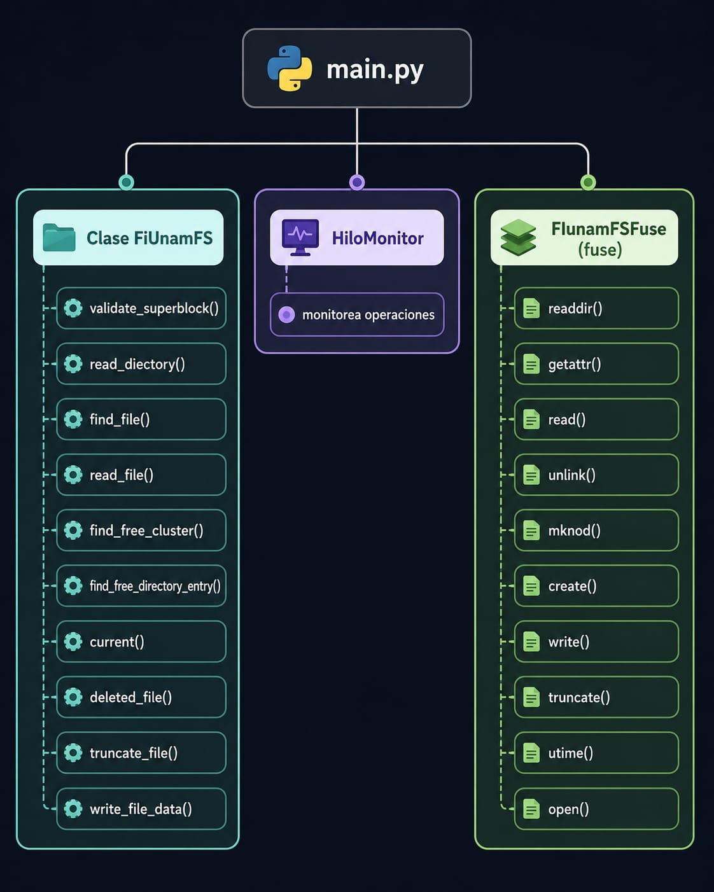, [[./BrenaVictor-CruzLizbeth/img/listado2.jpeg][listado2.jpeg]], [[./BrenaVictor-CruzLizbeth/img/mapa.jpeg][mapa.jpeg]], [[./BrenaVictor-CruzLizbeth/img/pruebas2.jpeg][pruebas2.jpeg]],
- Archivos :: [[./BrenaVictor-CruzLizbeth/fiunamfs.py][fiunamfs.py]], [[./BrenaVictor-CruzLizbeth/fuse_interface.py][fuse_interface.py]], [[./BrenaVictor-CruzLizbeth/main.py][main.py]]
- Concurrencia / sincronización ::
  - Candado reentrante (/RLock/) para asegurar que únicamente un hilo
    manipule el apuntador interno a datos (la /cabeza lectora/), que se
    manipula mediante =seek()=
  - Hay un hilo adicional =monitor_thread= que reporta a consola los
    eventos (llamadas) realizados.
- Interfaz :: FUSE
- Comentarios ::
  - ¡Bonitos diagramas! ¿Qué usaron para su generación?
  - Buena separación funcional en distintos módulos
  - Muy bien por hacer /tanto/ comentarios /como/ documentación técnica
    dentro del código 🤓
  - Trabajan sobre un archivo =fiunamfs.img= que tiene que estar en el
    directorio actual...
    - ...Tendrían que permitir especificar otro directorio de origen, o
      listarlo en =.gitignore= para que la ejecución del programa no
      /ensucie/ a la representación en Git del directorio actual.

|------------------------+---------+------+--------|
| Rubro                  | Parcial | Peso | Puntos |
|------------------------+---------+------+--------|
| Proyecto               |         |  0.3 |   3.00 |
| Cumplimiento           |      10 |      |   1.00 |
| Claridad de desarrollo |      10 |      |   1.00 |
| Interfaz usuario       |      10 |      |   1.00 |
|------------------------+---------+------+--------|
| Desarrollo             |         |  0.3 |   2.75 |
| Directorio de proyecto |     7.5 |      |   0.75 |
| Código válido          |      10 |      |   1.00 |
| Comentarios            |      10 |      |   1.00 |
|------------------------+---------+------+--------|
| Legibilidad            |         |  0.2 |   2.00 |
| Estructura             |      10 |      |   1.00 |
| Nomenclatura           |      10 |      |   1.00 |
|------------------------+---------+------+--------|
| Entrega                |         |  0.2 |   2.01 |
| Documentación externa  |      10 |      |   0.67 |
| Entorno y dependencias |      10 |      |   0.67 |
| Historia en Git        |      10 |      |   0.67 |
|------------------------+---------+------+--------|
| TOTAL                  |         |      |   9.76 |
|------------------------+---------+------+--------|
#+TBLFM: @2$4=min(10, @3+@4+@5);f2::@3$4=$2 * @2$3/3;f2::@4$4=$2 * @2$3/3;f2::@5$4=$2 * @2$3/3;f2::@6$4=min(10, @7+@8+@9);f2::@7$4=$2 * @6$3/3;f2::@8$4=$2 * @6$3/3;f2::@9$4=$2 * @6$3/3;f2::@10$4=min(10, @11+@12);f2::@11$4=$2 * @10$3/2;f2::@12$4=$2 * @10$3/2;f2::@13$4=min(10.0, @14+@15+@16);f2::@14$4=$2 * @13$3/3;f2::@15$4=$2 * @13$3/3;f2::@16$4=$2 * @13$3/3;f2::@17$4=@2$4+@6$4+@10$4+@13$4;f2

** Campos Isaac, Martinez Alejandro
- Documentación :: [[./CamposIsaac-MartinezAlejandro/Documentación.pdf][Documentación.pdf]], [[./CamposIsaac-MartinezAlejandro/README .md][README .md]]
- Archivos :: [[./CamposIsaac-MartinezAlejandro/fiunamfs/__init__.py][__init__.py]], [[./CamposIsaac-MartinezAlejandro/fiunamfs/disco.py][disco.py]], [[./CamposIsaac-MartinezAlejandro/fiunamfs/entrada.py][entrada.py]], [[./CamposIsaac-MartinezAlejandro/fiunamfs/herramientas.py][herramientas.py]],
  [[./CamposIsaac-MartinezAlejandro/fiunamfs/superbloque.py][superbloque.py]], [[./CamposIsaac-MartinezAlejandro/main.py][main.py]]
- Concurrencia / sincronización ::
  - Hilo auxiliar para manejar las escrituras en =Disco= (=hiloEscritura=)
  - Secciones críticas protegidas por =RLock=
  - Variable de condición (=Condition=) para notificar a =hiloEscritura= de
    tareas pendientes
- Interfaz :: FUSE
- Comentarios ::
  - ¿Por qué tienen /dos diferentes/ archivos de documentación?
    - Supongo que uno lo desarrolló Isaac y el otro Alejandro. El texto de
      cada uno es diferente.
    - Si difieren, ¿a cuál debería hacerle caso?
    - ¡Esto lleva a confusión del usuario!
    - Tengo que elegir a un archivo de documentación para referirme a él;
      voy a utilizar al README (e ignorar al PDF).
  - ¡Bien! Ya estaba extrañando ver archivos =.gitignore=. El de ustedes es
    correcto y completo 🙃
  - Buena separación funcional en módulos.
  - Creo que esto será cosa de un /dedazo/, pero... Al invocar al programa,
    /escupe/ esta advertencia a consola:
    #+begin_src text
      $ python3 main.py ../fiunamfs.img ../mnt/
      /home/gwolf/vcs/sistop-2026-2/proyectos/1/CamposIsaac-MartinezAlejandro/main.py:165: SyntaxWarning: invalid escape sequence '\E'
        print(f"\Error inesperado al leer la imagen: {e}\n", file=sys.stderr)
    #+end_src
    - Y dado que el programa regresa /exitosamente/ al prompt, me deja con
      la duda de si está activo o no (sí lo está, es sólo una
      /advertencia/, no un /error/)
    - con quitar el =\= que menciona se corrige el problema.

|------------------------+---------+------+--------|
| Rubro                  | Parcial | Peso | Puntos |
|------------------------+---------+------+--------|
| Proyecto               |         |  0.3 |   3.00 |
| Cumplimiento           |      10 |      |   1.00 |
| Claridad de desarrollo |      10 |      |   1.00 |
| Interfaz usuario       |      10 |      |   1.00 |
|------------------------+---------+------+--------|
| Desarrollo             |         |  0.3 |   2.75 |
| Directorio de proyecto |      10 |      |   1.00 |
| Código válido          |     7.5 |      |   0.75 |
| Comentarios            |      10 |      |   1.00 |
|------------------------+---------+------+--------|
| Legibilidad            |         |  0.2 |   2.00 |
| Estructura             |      10 |      |   1.00 |
| Nomenclatura           |      10 |      |   1.00 |
|------------------------+---------+------+--------|
| Entrega                |         |  0.2 |   1.84 |
| Documentación externa  |     7.5 |      |   0.50 |
| Entorno y dependencias |      10 |      |   0.67 |
| Historia en Git        |      10 |      |   0.67 |
|------------------------+---------+------+--------|
| TOTAL                  |         |      |   9.59 |
|------------------------+---------+------+--------|
#+TBLFM: @2$4=min(10, @3+@4+@5);f2::@3$4=$2 * @2$3/3;f2::@4$4=$2 * @2$3/3;f2::@5$4=$2 * @2$3/3;f2::@6$4=min(10, @7+@8+@9);f2::@7$4=$2 * @6$3/3;f2::@8$4=$2 * @6$3/3;f2::@9$4=$2 * @6$3/3;f2::@10$4=min(10, @11+@12);f2::@11$4=$2 * @10$3/2;f2::@12$4=$2 * @10$3/2;f2::@13$4=min(10.0, @14+@15+@16);f2::@14$4=$2 * @13$3/3;f2::@15$4=$2 * @13$3/3;f2::@16$4=$2 * @13$3/3;f2::@17$4=@2$4+@6$4+@10$4+@13$4;f2

** Chacon Hugo, Valdez Sebastian
- Documentación :: [[./ChaconHugo-ValdezSebastian/README.md][README.md]]
- Archivos :: [[./ChaconHugo-ValdezSebastian/LeerArchivo.py][LeerArchivo.py]]
- Concurrencia / sincronización ::
  - Todas las operaciones del hilo principal hacia el sistema de archivos
    están protegidas por un =Lock= (mutex)
    - Innecesario, porque no hay acceso concurrente
  - Hilo separado de la lógica general para el envío de mensajes a bitácora
  - La bitácora se “despierta” mediante las notificaciones enviadas por un
    =Queue=.
- Interfaz :: Menú sobre línea de comando
- Comentarios ::
  - No cubren varios de los puntos solicitados para la documentación
    externa
  - Está bueno que busquen a =fiunamfs.img= en el directorio actual o en el
    directorio padre
    - Pero la ejecución de su programa modifica un archivo en el
      repositorio
    - Deberían manejar un =.gitignore...=

|------------------------+---------+------+--------|
| Rubro                  | Parcial | Peso | Puntos |
|------------------------+---------+------+--------|
| Proyecto               |         |  0.3 |   2.75 |
| Cumplimiento           |      10 |      |   1.00 |
| Claridad de desarrollo |      10 |      |   1.00 |
| Interfaz usuario       |     7.5 |      |   0.75 |
|------------------------+---------+------+--------|
| Desarrollo             |         |  0.3 |   2.75 |
| Directorio de proyecto |     7.5 |      |   0.75 |
| Código válido          |      10 |      |   1.00 |
| Comentarios            |      10 |      |   1.00 |
|------------------------+---------+------+--------|
| Legibilidad            |         |  0.2 |   2.00 |
| Estructura             |      10 |      |   1.00 |
| Nomenclatura           |      10 |      |   1.00 |
|------------------------+---------+------+--------|
| Entrega                |         |  0.2 |   1.84 |
| Documentación externa  |     7.5 |      |   0.50 |
| Entorno y dependencias |      10 |      |   0.67 |
| Historia en Git        |      10 |      |   0.67 |
|------------------------+---------+------+--------|
| TOTAL                  |         |      |   9.34 |
|------------------------+---------+------+--------|
#+TBLFM: @2$4=min(10, @3+@4+@5);f2::@3$4=$2 * @2$3/3;f2::@4$4=$2 * @2$3/3;f2::@5$4=$2 * @2$3/3;f2::@6$4=min(10, @7+@8+@9);f2::@7$4=$2 * @6$3/3;f2::@8$4=$2 * @6$3/3;f2::@9$4=$2 * @6$3/3;f2::@10$4=min(10, @11+@12);f2::@11$4=$2 * @10$3/2;f2::@12$4=$2 * @10$3/2;f2::@13$4=min(10.0, @14+@15+@16);f2::@14$4=$2 * @13$3/3;f2::@15$4=$2 * @13$3/3;f2::@16$4=$2 * @13$3/3;f2::@17$4=@2$4+@6$4+@10$4+@13$4;f2

** Cruz Samuel
- Documentación :: [[./CruzSamuel/README.org][README.org]]
- Archivos :: [[./CruzSamuel/proyecto.py][proyecto.py]]
- Concurrencia / sincronización ::
  - Mutex (=Lock=) global para el acceso a la imagen
  - Mutex (=Lock=) obtenido para la /sección crítica/ (la lectura/escritura
    del dispositivo) de todas las funciones
  - Lanza los comandos solicitados como hilos /envueltos/, esperando su
    respuesta con =join()=
  - La concurrencia termina siendo incompleta / innecesaria para la
    implementación 🙁
- Interfaz :: Tanto FUSE como menú sobre línea de comando
- Comentarios ::
  - *Ojo*: Ante lo que dice tu documentación: ¡Python no es interpretado!
    (es lenguaje compilado a bytecode; únicamente el bytecode
    correspondiente es compilado).
  - ¡Buen manejo de excepciones para dar retroalimentación útil cuando no
    tienes fusepy instalado! 😃

|------------------------+---------+------+--------|
| Rubro                  | Parcial | Peso | Puntos |
|------------------------+---------+------+--------|
| Proyecto               |         |  0.3 |   2.75 |
| Cumplimiento           |     7.5 |      |   0.75 |
| Claridad de desarrollo |      10 |      |   1.00 |
| Interfaz usuario       |      10 |      |   1.00 |
|------------------------+---------+------+--------|
| Desarrollo             |         |  0.3 |   3.00 |
| Directorio de proyecto |      10 |      |   1.00 |
| Código válido          |      10 |      |   1.00 |
| Comentarios            |      10 |      |   1.00 |
|------------------------+---------+------+--------|
| Legibilidad            |         |  0.2 |   2.00 |
| Estructura             |      10 |      |   1.00 |
| Nomenclatura           |      10 |      |   1.00 |
|------------------------+---------+------+--------|
| Entrega                |         |  0.2 |   2.01 |
| Documentación externa  |      10 |      |   0.67 |
| Entorno y dependencias |      10 |      |   0.67 |
| Historia en Git        |      10 |      |   0.67 |
|------------------------+---------+------+--------|
| TOTAL                  |         |      |   9.76 |
|------------------------+---------+------+--------|
#+TBLFM: @2$4=min(10, @3+@4+@5);f2::@3$4=$2 * @2$3/3;f2::@4$4=$2 * @2$3/3;f2::@5$4=$2 * @2$3/3;f2::@6$4=min(10, @7+@8+@9);f2::@7$4=$2 * @6$3/3;f2::@8$4=$2 * @6$3/3;f2::@9$4=$2 * @6$3/3;f2::@10$4=min(10, @11+@12);f2::@11$4=$2 * @10$3/2;f2::@12$4=$2 * @10$3/2;f2::@13$4=min(10.0, @14+@15+@16);f2::@14$4=$2 * @13$3/3;f2::@15$4=$2 * @13$3/3;f2::@16$4=$2 * @13$3/3;f2::@17$4=@2$4+@6$4+@10$4+@13$4;f2

** Espinosa Sara, Rosete Karina
- Documentación :: [[./EspinosaSara-RoseteKarina/README.md][README.md]]
- Archivos :: [[./EspinosaSara-RoseteKarina/fiunamfs.c][fiunamfs.c]], [[./EspinosaSara-RoseteKarina/fiunamfs.h][fiunamfs.h]], [[./EspinosaSara-RoseteKarina/fuse_main.c][fuse_main.c]], [[./EspinosaSara-RoseteKarina/main.c][main.c]]
- Concurrencia / sincronización ::
  - Mutex =console_mutex= para evitar que ambos hilos escriban en el mismo
    tiempo
  - Mutex =fs->disk_lock= protegiendo todas las funciones que acceden a
    información
    - Demasiado grande/grueso, me parece: básicamente impide la operación
      concurrente, no es únicamente sobre donde se requiere
  - Hilo =worker_thread()= que es despertado por una variable de condición
    para realizar el trabajo
- Interfaz :: Tanto FUSE como menú sobre línea de comando
- Comentarios ::
  - ¡Excelente que se /avienten el trompo a la uña/ de escribir su
    implementación en C! 😃
    - Me parece interesante cómo se vincula su programa con las funciones
      disponibles en FUSE empleando =static const struct fuse_operations
      fi_ops=.
    - Nunca había visto la convención de uso de C que me parece que usan,
      con las variables /debajo de/ la firma de la variable y sin indentar,
      al igual que en las asignaciones a miembros de estructuras.... ¡Me
      parece feo! Pero... bueno, no se trata de mis /gustos/, sino que de
      ser /consistentes/
    - Sin embargo, sí hay inconsistencias en su manejo como estándar de
      código: Comparando el siguiente código:
      #+begin_src C
	static int fi_getattr(
	const char *path,
	struct stat *st,
	struct fuse_file_info *fi){
	    // (...)
        }
      #+end_src
      con el siguiente:
      #+begin_src C
	static void queue_push(CommandQueue *q,
	const CommandNode *cmd){
	    // (...)
	}
      #+end_src
  - Hay una (pequeña) corrección que hacer para sus instrucciones de
    compilación:
    - =gcc main.c fiunamfs.c fuse_main.c -o fiunamfs -lpthread -lfuse3=
      intenta combinar los tres archivos fuente, =main.c=, =fiunamfs.c= y
      =fuse_main.c=, pero en dos de ellos se define =main()=
    - El compilador no está contento:
      #+begin_src text
	$ gcc main.c fiunamfs.c fuse_main.c -o fiunamfs -lpthread -lfuse3
	/usr/bin/x86_64-linux-gnu-ld.bfd: /tmp/ccWGdWKP.o: in function `main':
	fuse_main.c:(.text+0x568): multiple definition of `main'; /tmp/ccSL9uSV.o:main.c:(.text+0x417): first defined here
	collect2: error: ld returned 1 exit status
      #+end_src
  - Hay que compilar ya sea la versión sin FUSE (=gcc fiunamfs.c main.c -o
    fiunamfs -lpthread=) o la versión con FUSE (=gcc fiunamfs.c fuse_main.c
    -o fiunamfs -lpthread -lfuse3=), no ambas.

|------------------------+---------+------+--------|
| Rubro                  | Parcial | Peso | Puntos |
|------------------------+---------+------+--------|
| Proyecto               |         |  0.3 |   2.75 |
| Cumplimiento           |      10 |      |   1.00 |
| Claridad de desarrollo |     7.5 |      |   0.75 |
| Interfaz usuario       |      10 |      |   1.00 |
|------------------------+---------+------+--------|
| Desarrollo             |         |  0.3 |   2.50 |
| Directorio de proyecto |      10 |      |   1.00 |
| Código válido          |     7.5 |      |   0.75 |
| Comentarios            |     7.5 |      |   0.75 |
|------------------------+---------+------+--------|
| Legibilidad            |         |  0.2 |   1.75 |
| Estructura             |     7.5 |      |   0.75 |
| Nomenclatura           |      10 |      |   1.00 |
|------------------------+---------+------+--------|
| Entrega                |         |  0.2 |   2.01 |
| Documentación externa  |      10 |      |   0.67 |
| Entorno y dependencias |      10 |      |   0.67 |
| Historia en Git        |      10 |      |   0.67 |
|------------------------+---------+------+--------|
| TOTAL                  |         |      |   9.01 |
|------------------------+---------+------+--------|
#+TBLFM: @2$4=min(10, @3+@4+@5);f2::@3$4=$2 * @2$3/3;f2::@4$4=$2 * @2$3/3;f2::@5$4=$2 * @2$3/3;f2::@6$4=min(10, @7+@8+@9);f2::@7$4=$2 * @6$3/3;f2::@8$4=$2 * @6$3/3;f2::@9$4=$2 * @6$3/3;f2::@10$4=min(10, @11+@12);f2::@11$4=$2 * @10$3/2;f2::@12$4=$2 * @10$3/2;f2::@13$4=min(10.0, @14+@15+@16);f2::@14$4=$2 * @13$3/3;f2::@15$4=$2 * @13$3/3;f2::@16$4=$2 * @13$3/3;f2::@17$4=@2$4+@6$4+@10$4+@13$4;f2

** Estrada Aldo, Sanchez Jazmin
- Documentación :: [[./EstradaAldo-SanchezJazmin/README.md][README.md]], [[./EstradaAldo-SanchezJazmin/img/Prueba1.jpg][Prueba1.jpg]], [[./EstradaAldo-SanchezJazmin/img/Prueba2.jpg][Prueba2.jpg]], [[./EstradaAldo-SanchezJazmin/img/Prueba3.jpg][Prueba3.jpg]],
  [[./EstradaAldo-SanchezJazmin/tests/archivo_prueba_nombre_muy_grande_para_error.txt][archivo_prueba_nombre_muy_grande_para_error.txt]], [[./EstradaAldo-SanchezJazmin/tests/nuevo.txt][nuevo.txt]], [[./EstradaAldo-SanchezJazmin/tests/prueba.txt][prueba.txt]]
- Archivos :: [[./EstradaAldo-SanchezJazmin/manejo_imagenes/fiunamfs.img][fiunamfs.img]], [[./EstradaAldo-SanchezJazmin/manejo_imagenes/fiunamfs_pruebas.img][fiunamfs_pruebas.img]], [[./EstradaAldo-SanchezJazmin/manejo_imagenes/modificar_imagen.py][modificar_imagen.py]],
  [[./EstradaAldo-SanchezJazmin/manejo_imagenes/restaurar_imagen.py][restaurar_imagen.py]], [[./EstradaAldo-SanchezJazmin/salida/README.org][README.org]], [[./EstradaAldo-SanchezJazmin/src/argumentos.py][argumentos.py]], [[./EstradaAldo-SanchezJazmin/src/constantes.py][constantes.py]], [[./EstradaAldo-SanchezJazmin/src/disco.py][disco.py]],
  [[./EstradaAldo-SanchezJazmin/src/entrada_directorio.py][entrada_directorio.py]], [[./EstradaAldo-SanchezJazmin/src/fiunamfs.py][fiunamfs.py]], [[./EstradaAldo-SanchezJazmin/src/main.py][main.py]], [[./EstradaAldo-SanchezJazmin/src/sincronizacion.py][sincronizacion.py]],
  [[./EstradaAldo-SanchezJazmin/src/sistema_fuse.py][sistema_fuse.py]]
- Concurrencia / sincronización ::
  - Separación entre el hilo de interacción con el usuario y el que
    implementa las operaciones
  - Las operaciones que acceden o modifican al sistema de archivos utilizan
    un =RLock= (=bloqueo_disco=)
    - Siendo únicamente un hilo que los realiza, este bloqueo resulta
      inencesario
  - Comunicación de mensajes a desplegar en pantalla mediante un =Queue=
    (únicamente para llamar a un =print()=
- Interfaz :: FUSE; interfaz secundaria mediante argumentos desde línea de
  comando
- Comentarios ::
  - Muy buena (¡y profunda!) organización de sus archivos en módulos,
    jerarquía de directorios de fuentes datos, constantes, imágenes, etc.

|------------------------+---------+------+--------|
| Rubro                  | Parcial | Peso | Puntos |
|------------------------+---------+------+--------|
| Proyecto               |         |  0.3 |   2.75 |
| Cumplimiento           |      10 |      |   1.00 |
| Claridad de desarrollo |     7.5 |      |   0.75 |
| Interfaz usuario       |      10 |      |   1.00 |
|------------------------+---------+------+--------|
| Desarrollo             |         |  0.3 |   2.75 |
| Directorio de proyecto |     7.5 |      |   0.75 |
| Código válido          |      10 |      |   1.00 |
| Comentarios            |      10 |      |   1.00 |
|------------------------+---------+------+--------|
| Legibilidad            |         |  0.2 |   2.00 |
| Estructura             |      10 |      |   1.00 |
| Nomenclatura           |      10 |      |   1.00 |
|------------------------+---------+------+--------|
| Entrega                |         |  0.2 |   2.01 |
| Documentación externa  |      10 |      |   0.67 |
| Entorno y dependencias |      10 |      |   0.67 |
| Historia en Git        |      10 |      |   0.67 |
|------------------------+---------+------+--------|
| TOTAL                  |         |      |   9.51 |
|------------------------+---------+------+--------|
#+TBLFM: @2$4=min(10, @3+@4+@5);f2::@3$4=$2 * @2$3/3;f2::@4$4=$2 * @2$3/3;f2::@5$4=$2 * @2$3/3;f2::@6$4=min(10, @7+@8+@9);f2::@7$4=$2 * @6$3/3;f2::@8$4=$2 * @6$3/3;f2::@9$4=$2 * @6$3/3;f2::@10$4=min(10, @11+@12);f2::@11$4=$2 * @10$3/2;f2::@12$4=$2 * @10$3/2;f2::@13$4=min(10.0, @14+@15+@16);f2::@14$4=$2 * @13$3/3;f2::@15$4=$2 * @13$3/3;f2::@16$4=$2 * @13$3/3;f2::@17$4=@2$4+@6$4+@10$4+@13$4;f2

** Ferrer José
- Documentación :: [[./FerrerJosé/README.md][README.md]]
- Archivos :: [[./FerrerJosé/fiunamfs/_init_.py][_init_.py]], [[./FerrerJosé/fiunamfs/directory.py][directory.py]], [[./FerrerJosé/fiunamfs/disk.py][disk.py]], [[./FerrerJosé/init_disk.py][init_disk.py]], [[./FerrerJosé/main.py][main.py]]
- Concurrencia / sincronización ::
  - Dos hilos: Ejecución de las operaciones (=worker_thread=) y
    registro/reporte (=log_thread=) de las operaciones
  - Las funciones llamadas por =worker_thread= utilizan un mutex
    (=disk_lock=), que envuelve la lógica completa de acceso al medio
    - =disk_lock= resulta innecesario, dado que hay un único
      =worker_thread=
  - =worker_thread= /“despierta”/ a =log_thread= mediante un =Queue=.
- Interfaz :: Comandos como argumentos presentados desde la línea de
  comando
- Comentarios ::
  - Incluyes un programa para inicializar un nuevo volumen. ¡muy bien! 🙂
  - Tu documentación apunta /únicamente/ al programa que inicializa el
    nuevo volumen, no al programa principal que desarrollaste.
  - La interfaz... Funciona, pero necesita un poco de amor 🙁
    - Muy básico, paso por varios errores para llegar a los resultados
      esperados
  - Dos de los archivos fuente (=_init_.py= y =directory.py=) son archivos
    vacíos. ¿Por qué?

|------------------------+---------+------+--------|
| Rubro                  | Parcial | Peso | Puntos |
|------------------------+---------+------+--------|
| Proyecto               |         |  0.3 |   2.50 |
| Cumplimiento           |      10 |      |   1.00 |
| Claridad de desarrollo |      10 |      |   1.00 |
| Interfaz usuario       |       5 |      |   0.50 |
|------------------------+---------+------+--------|
| Desarrollo             |         |  0.3 |   2.50 |
| Directorio de proyecto |      10 |      |   1.00 |
| Código válido          |      10 |      |   1.00 |
| Comentarios            |       5 |      |   0.50 |
|------------------------+---------+------+--------|
| Legibilidad            |         |  0.2 |   1.75 |
| Estructura             |     7.5 |      |   0.75 |
| Nomenclatura           |      10 |      |   1.00 |
|------------------------+---------+------+--------|
| Entrega                |         |  0.2 |   1.50 |
| Documentación externa  |     7.5 |      |   0.50 |
| Entorno y dependencias |      10 |      |   0.67 |
| Historia en Git        |       5 |      |   0.33 |
|------------------------+---------+------+--------|
| TOTAL                  |         |      |   8.25 |
|------------------------+---------+------+--------|
#+TBLFM: @2$4=min(10, @3+@4+@5);f2::@3$4=$2 * @2$3/3;f2::@4$4=$2 * @2$3/3;f2::@5$4=$2 * @2$3/3;f2::@6$4=min(10, @7+@8+@9);f2::@7$4=$2 * @6$3/3;f2::@8$4=$2 * @6$3/3;f2::@9$4=$2 * @6$3/3;f2::@10$4=min(10, @11+@12);f2::@11$4=$2 * @10$3/2;f2::@12$4=$2 * @10$3/2;f2::@13$4=min(10.0, @14+@15+@16);f2::@14$4=$2 * @13$3/3;f2::@15$4=$2 * @13$3/3;f2::@16$4=$2 * @13$3/3;f2::@17$4=@2$4+@6$4+@10$4+@13$4;f2

** Fredy Navarro, Ramirez Emily
- Documentación :: [[./FredyNavarro-RamirezEmily/README.md][README.md]], 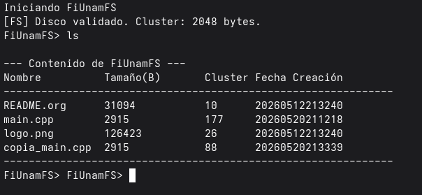, 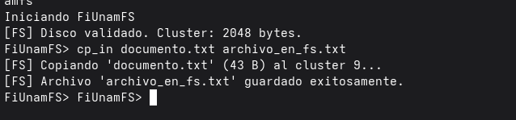, [[./FredyNavarro-RamirezEmily/imagen3.png][imagen3.png]],
  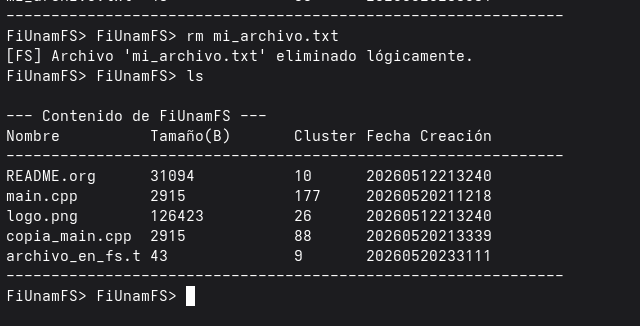, [[./FredyNavarro-RamirezEmily/imagen5.png][imagen5.png]]
- Archivos :: [[./FredyNavarro-RamirezEmily/estructuras.h][estructuras.h]], [[./FredyNavarro-RamirezEmily/main.cpp][main.cpp]], [[./FredyNavarro-RamirezEmily/sistema_archivos.cpp][sistema_archivos.cpp]],
  [[./FredyNavarro-RamirezEmily/sistema_archivos.h][sistema_archivos.h]]
- Concurrencia / sincronización ::
  - El shell interactúa con el usuario, actúa como /hilo productor/, va
    registrando las solicitude en una =std::queue=
  - Un hilo en /backend/ actúa como /hilo consumidor/, utilizando un
    =std::condition_variable=
- Interfaz :: Línea de comando interactiva (semi-shell)
- Comentarios ::
  - Me gustó ver que su documentación abordara los /aciertos y retos/ 😃
  - ¡Excelente ver equipos que implementen tareas en lenguajes distintos de
    Python! 😃
  - Bien por hacer /verificaciones de sanidad/ y responder con mensajes
    claros:
    #+begin_src text
      $ ./fiunamfs 
      Iniciando FiUnamFS
      [Error] No se pudo abrir fiunamfs.img
      Apagando motor por seguridad
    #+end_src
    (aunque tal vez debería /fallar exitosamente/, no quedarse en un shell
    inutilizado)
  - La interfaz usuario no es nada /descubrible/ 🙁 necesito referirme a la
    documentación para saber cómo hacer nada...
  - Un buen =.gitignore=, ¡bien! 😃

|------------------------+---------+------+--------|
| Rubro                  | Parcial | Peso | Puntos |
|------------------------+---------+------+--------|
| Proyecto               |         |  0.3 |   2.50 |
| Cumplimiento           |      10 |      |   1.00 |
| Claridad de desarrollo |      10 |      |   1.00 |
| Interfaz usuario       |       5 |      |   0.50 |
|------------------------+---------+------+--------|
| Desarrollo             |         |  0.3 |   3.00 |
| Directorio de proyecto |      10 |      |   1.00 |
| Código válido          |      10 |      |   1.00 |
| Comentarios            |      10 |      |   1.00 |
|------------------------+---------+------+--------|
| Legibilidad            |         |  0.2 |   2.00 |
| Estructura             |      10 |      |   1.00 |
| Nomenclatura           |      10 |      |   1.00 |
|------------------------+---------+------+--------|
| Entrega                |         |  0.2 |   2.01 |
| Documentación externa  |      10 |      |   0.67 |
| Entorno y dependencias |      10 |      |   0.67 |
| Historia en Git        |      10 |      |   0.67 |
|------------------------+---------+------+--------|
| TOTAL                  |         |      |   9.51 |
|------------------------+---------+------+--------|
#+TBLFM: @2$4=min(10, @3+@4+@5);f2::@3$4=$2 * @2$3/3;f2::@4$4=$2 * @2$3/3;f2::@5$4=$2 * @2$3/3;f2::@6$4=min(10, @7+@8+@9);f2::@7$4=$2 * @6$3/3;f2::@8$4=$2 * @6$3/3;f2::@9$4=$2 * @6$3/3;f2::@10$4=min(10, @11+@12);f2::@11$4=$2 * @10$3/2;f2::@12$4=$2 * @10$3/2;f2::@13$4=min(10.0, @14+@15+@16);f2::@14$4=$2 * @13$3/3;f2::@15$4=$2 * @13$3/3;f2::@16$4=$2 * @13$3/3;f2::@17$4=@2$4+@6$4+@10$4+@13$4;f2

** Garibay Josue, Lopez Carlos
- Documentación :: [[./GaribayJosue-LopezCarlos/README.md][README.md]], 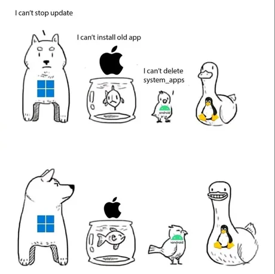, [[./GaribayJosue-LopezCarlos/img/Op3.png][Op3.png]], 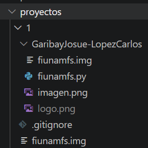,
  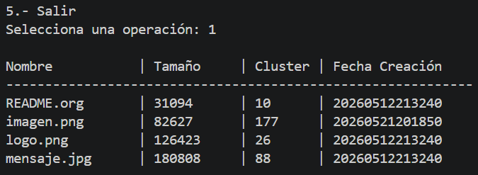, [[./GaribayJosue-LopezCarlos/img/disco.png][disco.png]], [[./GaribayJosue-LopezCarlos/img/op1.png][op1.png]], 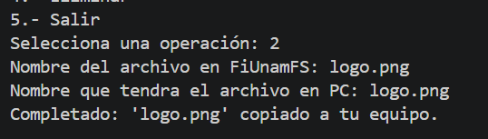, 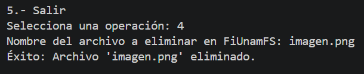, 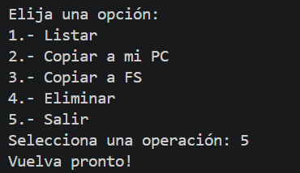,
  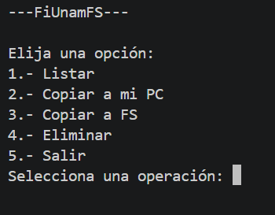, 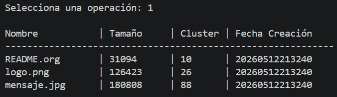, 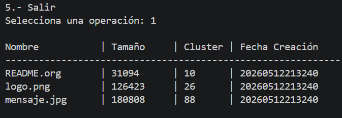
- Archivos :: [[./GaribayJosue-LopezCarlos/fiunamfs.img][fiunamfs.img]], [[./GaribayJosue-LopezCarlos/fiunamfs.py][fiunamfs.py]]
- Concurrencia / sincronización ::
  - mutex (=Lock=) sobre las operaciones sobre el disco
    - El mutex es demasiado grande/amplio: Rodea a /toda la función =run()=
      del hilo trabajador/: Resulta imposible en la práctica que ningún
      otro hilo lo pida; este mutex es inútil.
  - El hilo de control notifica las solicitudes del usuario mediante un
    =Queue= / =Event=
- Interfaz :: Menú sobre línea de comando
- Comentarios ::
  - Trabajan sobre un archivo =fiunamfs.img= que tiene que estar en el
    directorio actual...
    - ...Tendrían que permitir especificar otro directorio de origen, o
      listarlo en =.gitignore= para que la ejecución del programa no
      /ensucie/ a la representación en Git del directorio actual.

|------------------------+---------+------+--------|
| Rubro                  | Parcial | Peso | Puntos |
|------------------------+---------+------+--------|
| Proyecto               |         |  0.3 |   2.50 |
| Cumplimiento           |     7.5 |      |   0.75 |
| Claridad de desarrollo |      10 |      |   1.00 |
| Interfaz usuario       |     7.5 |      |   0.75 |
|------------------------+---------+------+--------|
| Desarrollo             |         |  0.3 |   2.50 |
| Directorio de proyecto |     7.5 |      |   0.75 |
| Código válido          |      10 |      |   1.00 |
| Comentarios            |     7.5 |      |   0.75 |
|------------------------+---------+------+--------|
| Legibilidad            |         |  0.2 |   2.00 |
| Estructura             |      10 |      |   1.00 |
| Nomenclatura           |      10 |      |   1.00 |
|------------------------+---------+------+--------|
| Entrega                |         |  0.2 |   2.01 |
| Documentación externa  |      10 |      |   0.67 |
| Entorno y dependencias |      10 |      |   0.67 |
| Historia en Git        |      10 |      |   0.67 |
|------------------------+---------+------+--------|
| TOTAL                  |         |      |   9.01 |
|------------------------+---------+------+--------|
#+TBLFM: @2$4=min(10, @3+@4+@5);f2::@3$4=$2 * @2$3/3;f2::@4$4=$2 * @2$3/3;f2::@5$4=$2 * @2$3/3;f2::@6$4=min(10, @7+@8+@9);f2::@7$4=$2 * @6$3/3;f2::@8$4=$2 * @6$3/3;f2::@9$4=$2 * @6$3/3;f2::@10$4=min(10, @11+@12);f2::@11$4=$2 * @10$3/2;f2::@12$4=$2 * @10$3/2;f2::@13$4=min(10.0, @14+@15+@16);f2::@14$4=$2 * @13$3/3;f2::@15$4=$2 * @13$3/3;f2::@16$4=$2 * @13$3/3;f2::@17$4=@2$4+@6$4+@10$4+@13$4;f2

** Gonzalez Fernando, Quezada Emir
- Documentación :: [[./GonzalezFernando-QuezadaEmir/README.md][README.md]]
- Archivos :: [[./GonzalezFernando-QuezadaEmir/fiunamfs.py][fiunamfs.py]], [[./GonzalezFernando-QuezadaEmir/functions.py][functions.py]], [[./GonzalezFernando-QuezadaEmir/interfazFUSE.py][interfazFUSE.py]], [[./GonzalezFernando-QuezadaEmir/main.py][main.py]],
  [[./GonzalezFernando-QuezadaEmir/monitor.py][monitor.py]]
- Concurrencia / sincronización ::
  - 
- Interfaz :: Tanto FUSE como comandos como argumentos presentados desde la
  línea de comando
- Comentarios ::
  - Aprovechan bien la separación en módulos entre las dos distintas
    interfaces y la lógica principal. ¡Bien! 😃
  - Me gusta que documenten cada función de manera consistente en forma de
    comentarios 😃
    - En Python es habitual usar el formato /docstrings/ (comentarios
      delimitados por un triple caracter ="= ) para diferenciar
      /documentación/ de /comentarios/.

|------------------------+---------+------+--------|
| Rubro                  | Parcial | Peso | Puntos |
|------------------------+---------+------+--------|
| Proyecto               |         |  0.3 |   3.00 |
| Cumplimiento           |      10 |      |   1.00 |
| Claridad de desarrollo |      10 |      |   1.00 |
| Interfaz usuario       |      10 |      |   1.00 |
|------------------------+---------+------+--------|
| Desarrollo             |         |  0.3 |   3.00 |
| Directorio de proyecto |      10 |      |   1.00 |
| Código válido          |      10 |      |   1.00 |
| Comentarios            |      10 |      |   1.00 |
|------------------------+---------+------+--------|
| Legibilidad            |         |  0.2 |   2.00 |
| Estructura             |      10 |      |   1.00 |
| Nomenclatura           |      10 |      |   1.00 |
|------------------------+---------+------+--------|
| Entrega                |         |  0.2 |   2.01 |
| Documentación externa  |      10 |      |   0.67 |
| Entorno y dependencias |      10 |      |   0.67 |
| Historia en Git        |      10 |      |   0.67 |
|------------------------+---------+------+--------|
| TOTAL                  |         |      |     10 |
|------------------------+---------+------+--------|
#+TBLFM: @2$4=min(10, @3+@4+@5);f2::@3$4=$2 * @2$3/3;f2::@4$4=$2 * @2$3/3;f2::@5$4=$2 * @2$3/3;f2::@6$4=min(10, @7+@8+@9);f2::@7$4=$2 * @6$3/3;f2::@8$4=$2 * @6$3/3;f2::@9$4=$2 * @6$3/3;f2::@10$4=min(10, @11+@12);f2::@11$4=$2 * @10$3/2;f2::@12$4=$2 * @10$3/2;f2::@13$4=min(10.0, @14+@15+@16);f2::@14$4=$2 * @13$3/3;f2::@15$4=$2 * @13$3/3;f2::@16$4=$2 * @13$3/3;f2::@17$4=@2$4+@6$4+@10$4+@13$4;f2

** Gonzalez Luis, Lopez Fernando
- Documentación :: 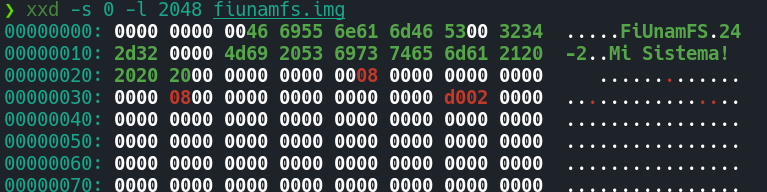, [[./GonzalezLuis-LopezFernando/Anexos/Pasted image 20260521222000.png][Pasted image
  20260521222000.png]], 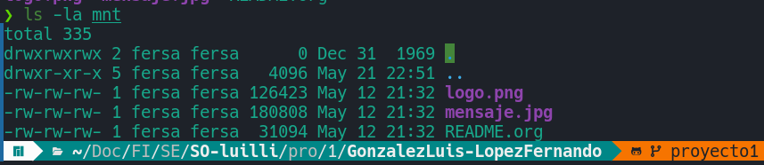, [[./GonzalezLuis-LopezFernando/Anexos/Pasted image 20260521233232.png][Pasted image
  20260521233232.png]], 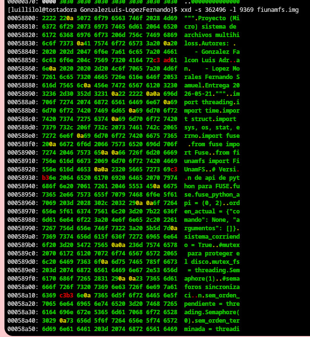, [[./GonzalezLuis-LopezFernando/Anexos/Pasted image 20260521233543.png][Pasted image
  20260521233543.png]], 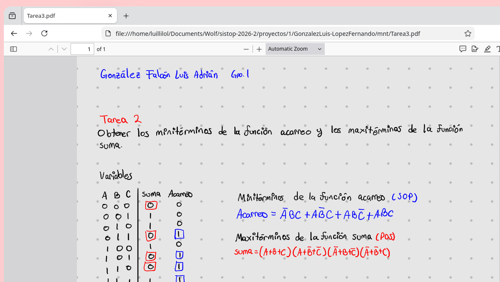, [[./GonzalezLuis-LopezFernando/Anexos/Pasted image 20260521233906.png][Pasted image
  20260521233906.png]], 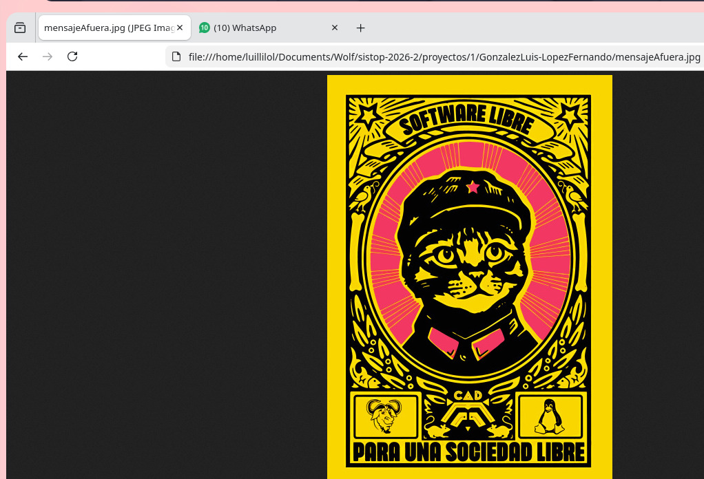, [[./GonzalezLuis-LopezFernando/Anexos/Pasted image 20260521233932.png][Pasted image
  20260521233932.png]], 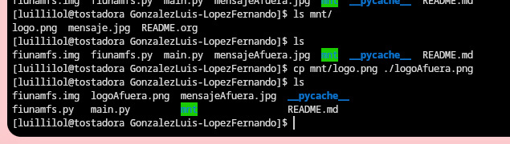, [[./GonzalezLuis-LopezFernando/Anexos/Pasted image 20260521234029.png][Pasted image
  20260521234029.png]], 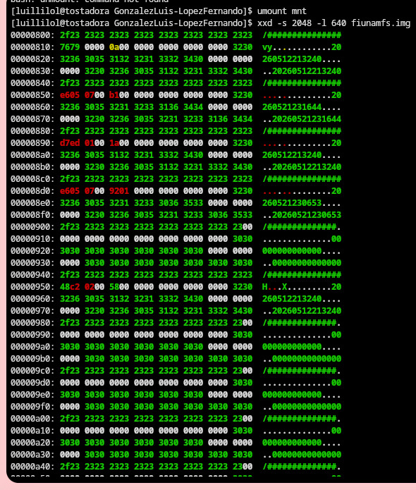, [[./GonzalezLuis-LopezFernando/README.md][README.md]]
- Archivos :: [[./GonzalezLuis-LopezFernando/fiunamfs.py][fiunamfs.py]], [[./GonzalezLuis-LopezFernando/main.py][main.py]]
- Concurrencia / sincronización ::
  - El hilo de interfaz deposita los comandos a procesar en =orden_actual=
  - El hilo =hilo_trabajador= recibe señalización mediante el semáforo
    =sem_orden_pendiente= y efectúa las operaciones, protegiendo de accesos
    concurrentes con el semáforo =mutex_fs=. Al terminar, libera el
    semáforo =sem_orden_terminada=.
- Interfaz :: FUSE
- Comentarios ::
  - Las dependencias están correctamente descritas 😃
    - Sin embargo, si especifican comandos específicos para instalarlas,
      tienen que mencionar /en qué sistema aplican/
    - Quienes no utilizamos distribuciones basadas en /Arch/, si no sabemos
      por dónde movernos, no podremos verificar su programa siguiéndolas.
  - Me gustó que mencionaran los comandos útiles empleados en el
    desarrollo.
  - Si ejecutamos el sistema sin tener una copia de =fiunamfs.img= en el
    directorio actual, el programa /falla silenciosamente/: No nos dice qué
    salió mal, sólo sale 🙁
  - La entrega incluye varias partes de código que utilizaron para el
    desarrollo y que dejaron comentado... Dificulta un poco la lectura del
    código 🙁

|------------------------+---------+------+--------|
| Rubro                  | Parcial | Peso | Puntos |
|------------------------+---------+------+--------|
| Proyecto               |         |  0.3 |   2.75 |
| Cumplimiento           |      10 |      |   1.00 |
| Claridad de desarrollo |     7.5 |      |   0.75 |
| Interfaz usuario       |      10 |      |   1.00 |
|------------------------+---------+------+--------|
| Desarrollo             |         |  0.3 |   3.00 |
| Directorio de proyecto |      10 |      |   1.00 |
| Código válido          |      10 |      |   1.00 |
| Comentarios            |      10 |      |   1.00 |
|------------------------+---------+------+--------|
| Legibilidad            |         |  0.2 |   1.75 |
| Estructura             |     7.5 |      |   0.75 |
| Nomenclatura           |      10 |      |   1.00 |
|------------------------+---------+------+--------|
| Entrega                |         |  0.2 |   2.01 |
| Documentación externa  |      10 |      |   0.67 |
| Entorno y dependencias |      10 |      |   0.67 |
| Historia en Git        |      10 |      |   0.67 |
|------------------------+---------+------+--------|
| TOTAL                  |         |      |   9.51 |
|------------------------+---------+------+--------|
#+TBLFM: @2$4=min(10, @3+@4+@5);f2::@3$4=$2 * @2$3/3;f2::@4$4=$2 * @2$3/3;f2::@5$4=$2 * @2$3/3;f2::@6$4=min(10, @7+@8+@9);f2::@7$4=$2 * @6$3/3;f2::@8$4=$2 * @6$3/3;f2::@9$4=$2 * @6$3/3;f2::@10$4=min(10, @11+@12);f2::@11$4=$2 * @10$3/2;f2::@12$4=$2 * @10$3/2;f2::@13$4=min(10.0, @14+@15+@16);f2::@14$4=$2 * @13$3/3;f2::@15$4=$2 * @13$3/3;f2::@16$4=$2 * @13$3/3;f2::@17$4=@2$4+@6$4+@10$4+@13$4;f2

** Gutiérrez Grimaldo Alejandro
- Documentación :: [[./GutiérrezGrimaldoAlejandro/README.md][README.md]], 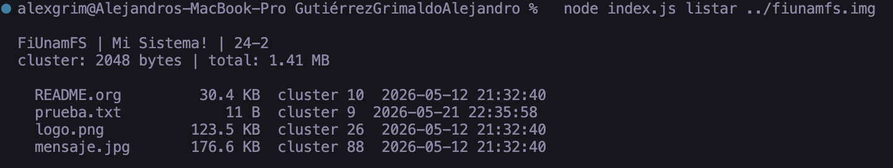, 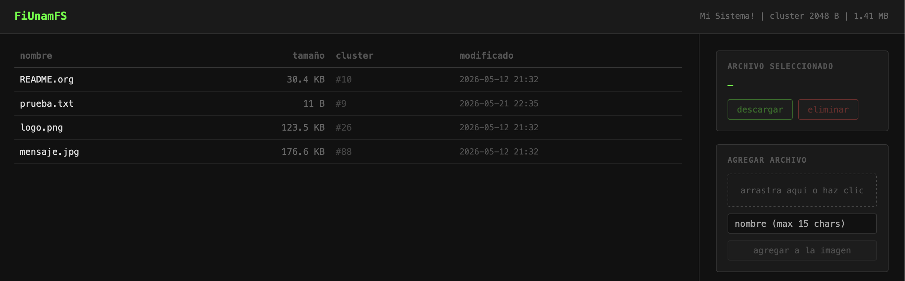
- Archivos :: [[./GutiérrezGrimaldoAlejandro/fiunamfs.js][fiunamfs.js]], [[./GutiérrezGrimaldoAlejandro/index.js][index.js]], [[./GutiérrezGrimaldoAlejandro/server.js][server.js]], [[./GutiérrezGrimaldoAlejandro/worker.js][worker.js]]
- Concurrencia / sincronización ::
  - Implementación de =worker_threads= para hilos independientes
  - Modelo de respuesta asíncrona mediante =parentPort.postMessage()= /
    =Worker.on('...')=xsxs
  - Pero no hay mecanismos de sincronización para evitar escrituras
    concurrentes
- Interfaz :: Dual: Web (NodeJS) y  desde línea de comando
- Comentarios ::
  - ¡Qué interesante implementación! Nunca me habían entregado la
    resolución de este ejercicio en JavaScript, cliente/servidor 😃
  - Me cuesta un tanto seguir tu lógica por falta de familiaridad con
    Javascript... y por la falta de comentarios 🙁

|------------------------+---------+------+--------|
| Rubro                  | Parcial | Peso | Puntos |
|------------------------+---------+------+--------|
| Proyecto               |         |  0.3 |   2.75 |
| Cumplimiento           |      10 |      |   1.00 |
| Claridad de desarrollo |     7.5 |      |   0.75 |
| Interfaz usuario       |      10 |      |   1.00 |
|------------------------+---------+------+--------|
| Desarrollo             |         |  0.3 |   2.50 |
| Directorio de proyecto |      10 |      |   1.00 |
| Código válido          |      10 |      |   1.00 |
| Comentarios            |       5 |      |   0.50 |
|------------------------+---------+------+--------|
| Legibilidad            |         |  0.2 |   1.75 |
| Estructura             |     7.5 |      |   0.75 |
| Nomenclatura           |      10 |      |   1.00 |
|------------------------+---------+------+--------|
| Entrega                |         |  0.2 |   2.01 |
| Documentación externa  |      10 |      |   0.67 |
| Entorno y dependencias |      10 |      |   0.67 |
| Historia en Git        |      10 |      |   0.67 |
|------------------------+---------+------+--------|
| TOTAL                  |         |      |   9.01 |
|------------------------+---------+------+--------|
#+TBLFM: @2$4=min(10, @3+@4+@5);f2::@3$4=$2 * @2$3/3;f2::@4$4=$2 * @2$3/3;f2::@5$4=$2 * @2$3/3;f2::@6$4=min(10, @7+@8+@9);f2::@7$4=$2 * @6$3/3;f2::@8$4=$2 * @6$3/3;f2::@9$4=$2 * @6$3/3;f2::@10$4=min(10, @11+@12);f2::@11$4=$2 * @10$3/2;f2::@12$4=$2 * @10$3/2;f2::@13$4=min(10.0, @14+@15+@16);f2::@14$4=$2 * @13$3/3;f2::@15$4=$2 * @13$3/3;f2::@16$4=$2 * @13$3/3;f2::@17$4=@2$4+@6$4+@10$4+@13$4;f2

** Martinez Hans, Blancas Isaias
- Documentación :: [[./MartinezHans_BlancasIsaias/README.md][README.md]], [[./MartinezHans_BlancasIsaias/requirements.txt][requirements.txt]]
- Archivos :: [[./MartinezHans_BlancasIsaias/directory.py][directory.py]], [[./MartinezHans_BlancasIsaias/filesystem.py][filesystem.py]], [[./MartinezHans_BlancasIsaias/fiunamfs.img][fiunamfs.img]], [[./MartinezHans_BlancasIsaias/main.py][main.py]], [[./MartinezHans_BlancasIsaias/operations.py][operations.py]], [[./MartinezHans_BlancasIsaias/sync_manager.py][sync_manager.py]], [[./MartinezHans_BlancasIsaias/ui.py][ui.py]]
- Concurrencia / sincronización ::
  - Se generan hilos únicamente en la opción =5. Probar concurrencia=
    - Realiza tres listados del directorio concurrentemente con una copia
      de archivo
  - Todas las funciones de acceso a datos utilizan un mutex sobre el 100%
    de su lógica.
- Interfaz :: Menú sobre línea de comando
- Comentarios ::
  - No hay comentarios en el código 🙁
  - Trabajan sobre un archivo =fiunamfs.img= que tiene que estar en el
    directorio actual...
    - ...Tendrían que permitir especificar otro directorio de origen, o
      listarlo en =.gitignore= para que la ejecución del programa no
      /ensucie/ a la representación en Git del directorio actual.
    - El =.gitignore= existe, pero únicamente cubre a los archivos =*.pyc=
      y, curiosamente, al contenido del sistema de archivos ejemplo
      (=logo.png= y =*.org=)

|------------------------+---------+------+--------|
| Rubro                  | Parcial | Peso | Puntos |
|------------------------+---------+------+--------|
| Proyecto               |         |  0.3 |   2.00 |
| Cumplimiento           |     7.5 |      |   0.75 |
| Claridad de desarrollo |     7.5 |      |   0.75 |
| Interfaz usuario       |       5 |      |   0.50 |
|------------------------+---------+------+--------|
| Desarrollo             |         |  0.3 |   2.50 |
| Directorio de proyecto |      10 |      |   1.00 |
| Código válido          |      10 |      |   1.00 |
| Comentarios            |       5 |      |   0.50 |
|------------------------+---------+------+--------|
| Legibilidad            |         |  0.2 |   1.75 |
| Estructura             |     7.5 |      |   0.75 |
| Nomenclatura           |      10 |      |   1.00 |
|------------------------+---------+------+--------|
| Entrega                |         |  0.2 |   1.67 |
| Documentación externa  |      10 |      |   0.67 |
| Entorno y dependencias |      10 |      |   0.67 |
| Historia en Git        |       5 |      |   0.33 |
|------------------------+---------+------+--------|
| TOTAL                  |         |      |   7.92 |
|------------------------+---------+------+--------|
#+TBLFM: @2$4=min(10, @3+@4+@5);f2::@3$4=$2 * @2$3/3;f2::@4$4=$2 * @2$3/3;f2::@5$4=$2 * @2$3/3;f2::@6$4=min(10, @7+@8+@9);f2::@7$4=$2 * @6$3/3;f2::@8$4=$2 * @6$3/3;f2::@9$4=$2 * @6$3/3;f2::@10$4=min(10, @11+@12);f2::@11$4=$2 * @10$3/2;f2::@12$4=$2 * @10$3/2;f2::@13$4=min(10.0, @14+@15+@16);f2::@14$4=$2 * @13$3/3;f2::@15$4=$2 * @13$3/3;f2::@16$4=$2 * @13$3/3;f2::@17$4=@2$4+@6$4+@10$4+@13$4;f2

** Merida Francisco, Quezada Leonardo
- Documentación :: [[./MeridaFrancisco-QuezadaLeonardo/README.md][README.md]]
- Archivos :: [[./MeridaFrancisco-QuezadaLeonardo/FUSE.py][FUSE.py]], [[./MeridaFrancisco-QuezadaLeonardo/bitacora.py][bitacora.py]], [[./MeridaFrancisco-QuezadaLeonardo/config_fiunamfs.py][config_fiunamfs.py]], [[./MeridaFrancisco-QuezadaLeonardo/fiunamfs.img][fiunamfs.img]],
  [[./MeridaFrancisco-QuezadaLeonardo/imagen_fiunamfs.py][imagen_fiunamfs.py]], [[./MeridaFrancisco-QuezadaLeonardo/interfaz.py][interfaz.py]], [[./MeridaFrancisco-QuezadaLeonardo/registro_directorio.py][registro_directorio.py]], [[./MeridaFrancisco-QuezadaLeonardo/trabajador.py][trabajador.py]]
- Concurrencia / sincronización ::
  - Lanza un hilo para =_procesar_tareas()= que se mantiene dentro de un
    =while self.activo=, esperando por elementos agregados =self.tareas=
    (un =Queue=)
  - Las funciones de acceso a datos utilizan todas un =RLock=, pero lo
    requieren desde la primera línea de la función y sobre todo su cuerpo.
    - Además, nunca habrá concurrencia entre ellas, dado que hay un único
      hilo trabajador
- Interfaz :: Tanto interfaz GUI con Tk como FUSE
- Comentarios ::
  - Trabajan sobre un archivo =fiunamfs.img= que tiene que estar en el
    directorio actual...
    - ...Tendrían que permitir especificar otro directorio de origen, o
      listarlo en =.gitignore= para que la ejecución del programa no
      /ensucie/ a la representación en Git del directorio actual.
    - Misma cosa para la compilación a bytecode del código Python a
      =__pycache__=

|------------------------+---------+------+--------|
| Rubro                  | Parcial | Peso | Puntos |
|------------------------+---------+------+--------|
| Proyecto               |         |  0.3 |   2.75 |
| Cumplimiento           |     7.5 |      |   0.75 |
| Claridad de desarrollo |      10 |      |   1.00 |
| Interfaz usuario       |      10 |      |   1.00 |
|------------------------+---------+------+--------|
| Desarrollo             |         |  0.3 |   2.75 |
| Directorio de proyecto |     7.5 |      |   0.75 |
| Código válido          |      10 |      |   1.00 |
| Comentarios            |      10 |      |   1.00 |
|------------------------+---------+------+--------|
| Legibilidad            |         |  0.2 |   2.00 |
| Estructura             |      10 |      |   1.00 |
| Nomenclatura           |      10 |      |   1.00 |
|------------------------+---------+------+--------|
| Entrega                |         |  0.2 |   2.01 |
| Documentación externa  |      10 |      |   0.67 |
| Entorno y dependencias |      10 |      |   0.67 |
| Historia en Git        |      10 |      |   0.67 |
|------------------------+---------+------+--------|
| TOTAL                  |         |      |   9.51 |
|------------------------+---------+------+--------|
#+TBLFM: @2$4=min(10, @3+@4+@5);f2::@3$4=$2 * @2$3/3;f2::@4$4=$2 * @2$3/3;f2::@5$4=$2 * @2$3/3;f2::@6$4=min(10, @7+@8+@9);f2::@7$4=$2 * @6$3/3;f2::@8$4=$2 * @6$3/3;f2::@9$4=$2 * @6$3/3;f2::@10$4=min(10, @11+@12);f2::@11$4=$2 * @10$3/2;f2::@12$4=$2 * @10$3/2;f2::@13$4=min(10.0, @14+@15+@16);f2::@14$4=$2 * @13$3/3;f2::@15$4=$2 * @13$3/3;f2::@16$4=$2 * @13$3/3;f2::@17$4=@2$4+@6$4+@10$4+@13$4;f2

** Monroy Jesus, Ponce de Leon Bruno
- Documentación :: [[./MonroyJesus-PoncedeLeonBruno/README.md][README.md]], [[./MonroyJesus-PoncedeLeonBruno/img/ejemploCopiar1.png][ejemploCopiar1.png]], 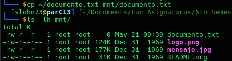,
  [[./MonroyJesus-PoncedeLeonBruno/img/ejemploEliminar.png][ejemploEliminar.png]], 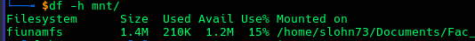, [[./MonroyJesus-PoncedeLeonBruno/img/ejemploListarContenido.png][ejemploListarContenido.png]],
  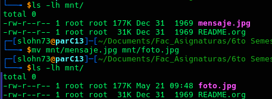, 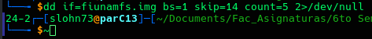
- Archivos :: [[./MonroyJesus-PoncedeLeonBruno/Makefile][Makefile]], [[./MonroyJesus-PoncedeLeonBruno/fiunamfs.c][fiunamfs.c]], [[./MonroyJesus-PoncedeLeonBruno/fiunamfs.img][fiunamfs.img]]
- Concurrencia / sincronización ::
  - El hilo primario de interacción maneja las operaciones más rápidas
  - Activa la variable de condición =sync_cond= para llamar al hilo de
    manejo de operaciones de disco
  - Éste realiza los cambios “lentos” en la unidad, y vuelve a dormir a
    espera del siguiente evento
- Interfaz :: FUSE
- Comentarios ::
  - ¡Excelente que se /avienten el trompo a la uña/ de escribir su
    implementación en C! 😃
    - Y muy bonito el =Makefile=, ayuda mucho a saber cómo compilar 😉
    - Me gusta también que tengan toda la sección de =#define='s con los
      parámetros del sistema de archivos
  - Documentación muy completa. ¡Muy bien!
  - ¡Ojo! El sistema de archivos planteado sí tiene suficiente información
    para manejar la fecha correcta. (pero sí, es /pecata minuta/)
  - Buen uso de funciones con longitud fija verificación de tamaño
    (=memcpy=, =strncpy=).
  - Muy baja densidad de comentarios 🙁
  - Ojo, copiar un archivo hacia el sistema de archivos no funciona 🙁
    - El archivo generado queda de 0 bytes
    - Lo confirma la imagen de su documentación: Tras copiar un archivo
      =documento.txt= de 4.2KB, muestran:
      
    - En mi sistema:
      #+begin_src text
	$ ./fiunamfs fiunamfs.img mnt/ 
	 > Version detectada  : 24-2
	FiUnamFS montando 'fiunamfs.img'
	 > Etiqueta           : Mi Sistema!    
	 > Tamanio del cluster: 2048 bytes
	 > Clusters para Dir  : 8
	 > Total de clusters  : 720
	 > Archivos encontrados: 3
	$ date > mnt/prueba
	date: write error: No space left on device
	$ ls -hl mnt/prueba
	total 0
	-rw-r--r-- 1 root root    0 May 28 00:19 prueba
      #+end_src

|------------------------+---------+------+--------|
| Rubro                  | Parcial | Peso | Puntos |
|------------------------+---------+------+--------|
| Proyecto               |         |  0.3 |   2.25 |
| Cumplimiento           |     7.5 |      |   0.75 |
| Claridad de desarrollo |     7.5 |      |   0.75 |
| Interfaz usuario       |     7.5 |      |   0.75 |
|------------------------+---------+------+--------|
| Desarrollo             |         |  0.3 |   2.75 |
| Directorio de proyecto |      10 |      |   1.00 |
| Código válido          |      10 |      |   1.00 |
| Comentarios            |     7.5 |      |   0.75 |
|------------------------+---------+------+--------|
| Legibilidad            |         |  0.2 |   2.00 |
| Estructura             |      10 |      |   1.00 |
| Nomenclatura           |      10 |      |   1.00 |
|------------------------+---------+------+--------|
| Entrega                |         |  0.2 |   2.01 |
| Documentación externa  |      10 |      |   0.67 |
| Entorno y dependencias |      10 |      |   0.67 |
| Historia en Git        |      10 |      |   0.67 |
|------------------------+---------+------+--------|
| TOTAL                  |         |      |   9.01 |
|------------------------+---------+------+--------|
#+TBLFM: @2$4=min(10, @3+@4+@5);f2::@3$4=$2 * @2$3/3;f2::@4$4=$2 * @2$3/3;f2::@5$4=$2 * @2$3/3;f2::@6$4=min(10, @7+@8+@9);f2::@7$4=$2 * @6$3/3;f2::@8$4=$2 * @6$3/3;f2::@9$4=$2 * @6$3/3;f2::@10$4=min(10, @11+@12);f2::@11$4=$2 * @10$3/2;f2::@12$4=$2 * @10$3/2;f2::@13$4=min(10.0, @14+@15+@16);f2::@14$4=$2 * @13$3/3;f2::@15$4=$2 * @13$3/3;f2::@16$4=$2 * @13$3/3;f2::@17$4=@2$4+@6$4+@10$4+@13$4;f2

** Ortega Fernando, Lopez Derek
- Documentación :: [[./OrtegaFernando-LopezDerek/Prueba.txt][Prueba.txt]], [[./OrtegaFernando-LopezDerek/README.md][README.md]], [[./OrtegaFernando-LopezDerek/mnt/Prueba.txt][Prueba.txt]]
- Archivos :: [[./OrtegaFernando-LopezDerek/filesystem.py][filesystem.py]], [[./OrtegaFernando-LopezDerek/fuse_main.py][fuse_main.py]]
- Concurrencia / sincronización ::
  - Todas las funciones de acceso al sistema de archivos utilizan un mutex
    (=self.lock = threading.Lock()=)
    - Justificación de la documentación: /«Aunque FUSE maneja múltiples
      hilos de forma nativa cuando el Kernel/ /recibe peticiones, nuestro
      Lock garantiza que la imagen física (.img)/ /no sufra condiciones de
      carrera (Race Conditions) o corrupción de punteros.»/
    - Esto... no es así 🙁 FUSE va a hacer llamadas al único hilo del único
      proceso que ustedes lancen.
- Interfaz :: FUSE
- Comentarios ::
  - No es posible copiar archivos /hacia/ el sistema de archivos: se crea
    el archivo, pero no su contenido:
    #+begin_src text
      $ ls OrtegaFernando-LopezDerek/mnt/ -l
      total 0
      -rw-r--r-- 1 root root 126423 Dec 31  1969 logo.png
      -rw-r--r-- 1 root root 180808 Dec 31  1969 mensaje.jpg
      -rw-r--r-- 1 root root  31094 Dec 31  1969 README.org
      $ date > OrtegaFernando-LopezDerek/mnt/fecha.txt
      bash: OrtegaFernando-LopezDerek/mnt/fecha.txt: No such file or directory
      $ ls OrtegaFernando-LopezDerek/mnt/ -l
      total 0
      -rw-r--r-- 1 root root 126423 Dec 31  1969 logo.png
      -rw-r--r-- 1 root root 180808 Dec 31  1969 mensaje.jpg
      -rw-r--r-- 1 root root  31094 Dec 31  1969 README.org
    #+end_src
    En la terminal controladora:
    #+begin_src text
      $ python3 fuse_main.py ../fiunamfs.img mnt/
      ADVERTENCIA: Se esperaba '26-2', se encontró '24-2'.
      Ejecutando debido a que se usó esa versión para generar la imagen...
      Uncaught exception from FUSE operation release, returning errno.EINVAL.
      Traceback (most recent call last):
        File "/home/gwolf/vcs/sistop-2026-2/proyectos/1/.venv/lib/python3.13/site-packages/fuse.py", line 734, in _wrapper
          return func(*args, **kwargs) or 0
                 ~~~~^^^^^^^^^^^^^^^^^
        File "/home/gwolf/vcs/sistop-2026-2/proyectos/1/.venv/lib/python3.13/site-packages/fuse.py", line 892, in release
          return self.operations('release', self._decode_optional_path(path), fh)
                 ~~~~~~~~~~~~~~~^^^^^^^^^^^^^^^^^^^^^^^^^^^^^^^^^^^^^^^^^^^^^^^^^
        File "/home/gwolf/vcs/sistop-2026-2/proyectos/1/.venv/lib/python3.13/site-packages/fuse.py", line 1076, in __call__
          return getattr(self, op)(*args)
                 ~~~~~~~~~~~~~~~~~^^^^^^^
        File "/home/gwolf/vcs/sistop-2026-2/proyectos/1/OrtegaFernando-LopezDerek/fuse_main.py", line 50, in release
          self.fs.escribir_bytes_archivo(path[1:], self.write_buffer[path])
          ~~~~~~~~~~~~~~~~~~~~~~~~~~~~~~^^^^^^^^^^^^^^^^^^^^^^^^^^^^^^^^^^^
        File "/home/gwolf/vcs/sistop-2026-2/proyectos/1/OrtegaFernando-LopezDerek/filesystem.py", line 298, in escribir_bytes_archivo
          raise Exception("No hay espacio en directorio")
      Exception: No hay espacio en directorio
    #+end_src

|------------------------+---------+------+--------|
| Rubro                  | Parcial | Peso | Puntos |
|------------------------+---------+------+--------|
| Proyecto               |         |  0.3 |   2.50 |
| Cumplimiento           |       5 |      |   0.50 |
| Claridad de desarrollo |      10 |      |   1.00 |
| Interfaz usuario       |      10 |      |   1.00 |
|------------------------+---------+------+--------|
| Desarrollo             |         |  0.3 |   2.75 |
| Directorio de proyecto |      10 |      |   1.00 |
| Código válido          |     7.5 |      |   0.75 |
| Comentarios            |      10 |      |   1.00 |
|------------------------+---------+------+--------|
| Legibilidad            |         |  0.2 |   2.00 |
| Estructura             |      10 |      |   1.00 |
| Nomenclatura           |      10 |      |   1.00 |
|------------------------+---------+------+--------|
| Entrega                |         |  0.2 |   2.01 |
| Documentación externa  |      10 |      |   0.67 |
| Entorno y dependencias |      10 |      |   0.67 |
| Historia en Git        |      10 |      |   0.67 |
|------------------------+---------+------+--------|
| TOTAL                  |         |      |   9.26 |
|------------------------+---------+------+--------|
#+TBLFM: @2$4=min(10, @3+@4+@5);f2::@3$4=$2 * @2$3/3;f2::@4$4=$2 * @2$3/3;f2::@5$4=$2 * @2$3/3;f2::@6$4=min(10, @7+@8+@9);f2::@7$4=$2 * @6$3/3;f2::@8$4=$2 * @6$3/3;f2::@9$4=$2 * @6$3/3;f2::@10$4=min(10, @11+@12);f2::@11$4=$2 * @10$3/2;f2::@12$4=$2 * @10$3/2;f2::@13$4=min(10.0, @14+@15+@16);f2::@14$4=$2 * @13$3/3;f2::@15$4=$2 * @13$3/3;f2::@16$4=$2 * @13$3/3;f2::@17$4=@2$4+@6$4+@10$4+@13$4;f2

** Quiroz Sergio
- Documentación :: [[./QuirozSergio/README.md][README.md]]
- Archivos :: [[./QuirozSergio/fiunamfs.py][fiunamfs.py]]
- Concurrencia / sincronización ::
  - Separación de hilo de control (UI) e hilo de trabajo (I/O)
  - Señalización mediante =Event=
- Interfaz :: Comandos como argumentos presentados desde la línea de
  comando
- Comentarios ::
  - Código bien documentado, con los parámetros del sistema las constantes
    claramente separadas al inicio del código

|------------------------+---------+------+--------|
| Rubro                  | Parcial | Peso | Puntos |
|------------------------+---------+------+--------|
| Proyecto               |         |  0.3 |   2.75 |
| Cumplimiento           |      10 |      |   1.00 |
| Claridad de desarrollo |      10 |      |   1.00 |
| Interfaz usuario       |     7.5 |      |   0.75 |
|------------------------+---------+------+--------|
| Desarrollo             |         |  0.3 |   3.00 |
| Directorio de proyecto |      10 |      |   1.00 |
| Código válido          |      10 |      |   1.00 |
| Comentarios            |      10 |      |   1.00 |
|------------------------+---------+------+--------|
| Legibilidad            |         |  0.2 |   2.00 |
| Estructura             |      10 |      |   1.00 |
| Nomenclatura           |      10 |      |   1.00 |
|------------------------+---------+------+--------|
| Entrega                |         |  0.2 |   2.01 |
| Documentación externa  |      10 |      |   0.67 |
| Entorno y dependencias |      10 |      |   0.67 |
| Historia en Git        |      10 |      |   0.67 |
|------------------------+---------+------+--------|
| TOTAL                  |         |      |   9.76 |
|------------------------+---------+------+--------|
#+TBLFM: @2$4=min(10, @3+@4+@5);f2::@3$4=$2 * @2$3/3;f2::@4$4=$2 * @2$3/3;f2::@5$4=$2 * @2$3/3;f2::@6$4=min(10, @7+@8+@9);f2::@7$4=$2 * @6$3/3;f2::@8$4=$2 * @6$3/3;f2::@9$4=$2 * @6$3/3;f2::@10$4=min(10, @11+@12);f2::@11$4=$2 * @10$3/2;f2::@12$4=$2 * @10$3/2;f2::@13$4=min(10.0, @14+@15+@16);f2::@14$4=$2 * @13$3/3;f2::@15$4=$2 * @13$3/3;f2::@16$4=$2 * @13$3/3;f2::@17$4=@2$4+@6$4+@10$4+@13$4;f2

** Sotomayor Edgar, Teran Jorge
- Documentación :: [[./SotomayorEdgar-TeranJorge/README.md][README.md]], 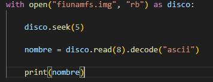, 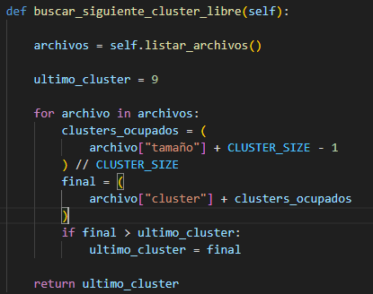, 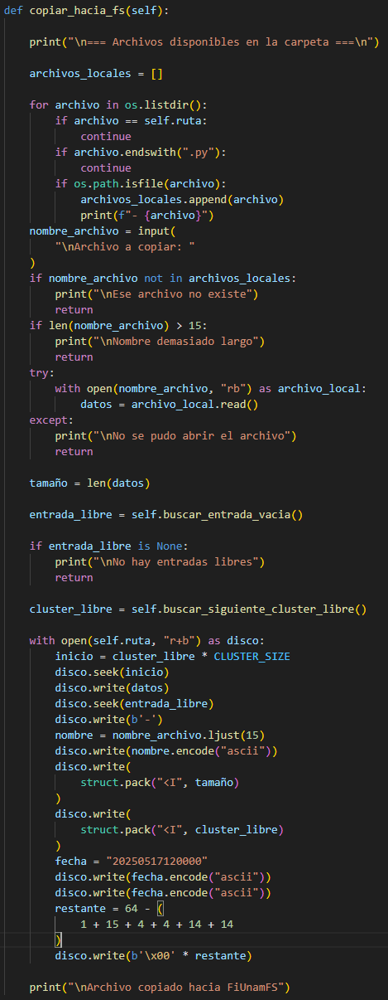,
  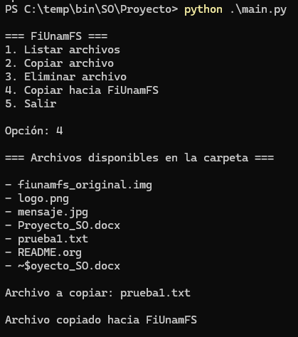, 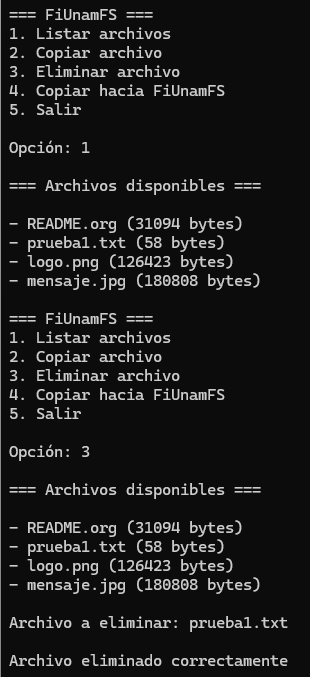, 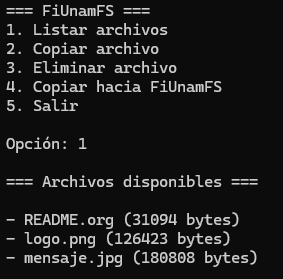, 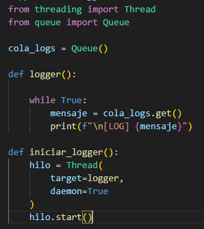,
  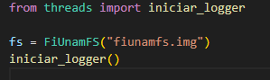, 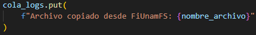, 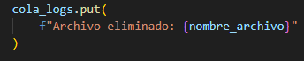, 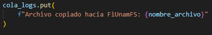, 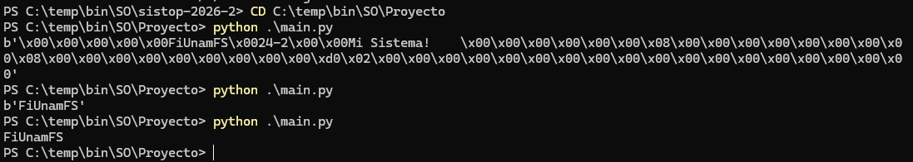,
  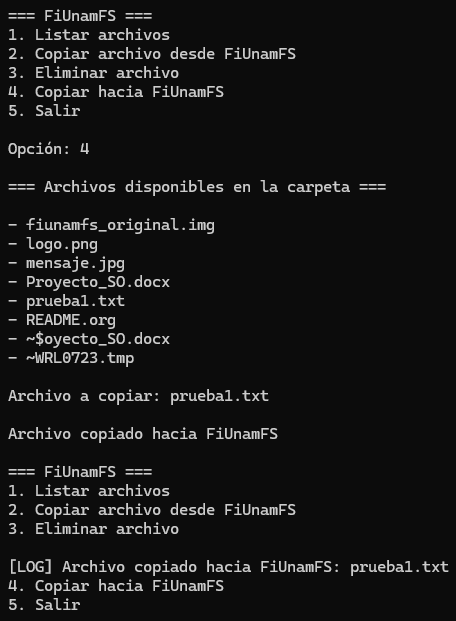, 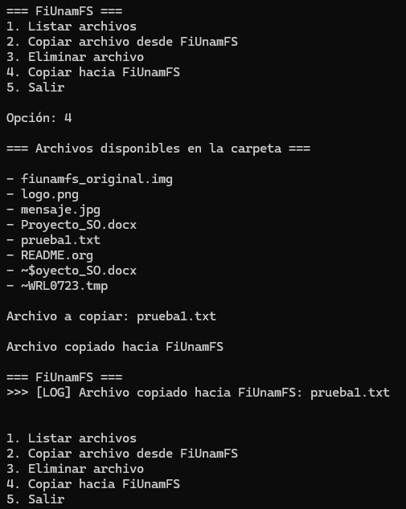, 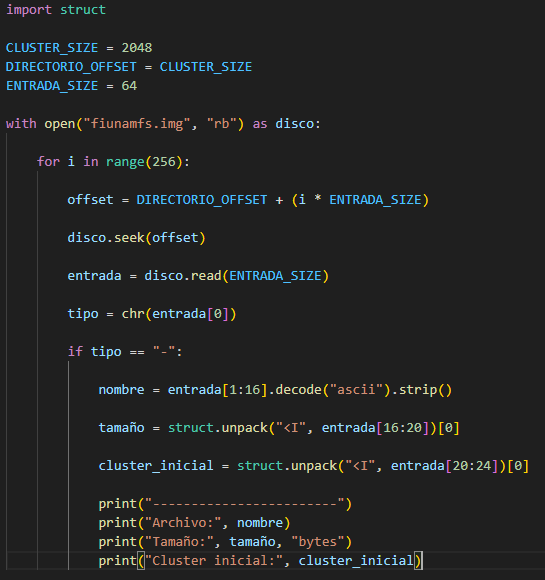, 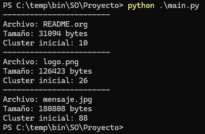, 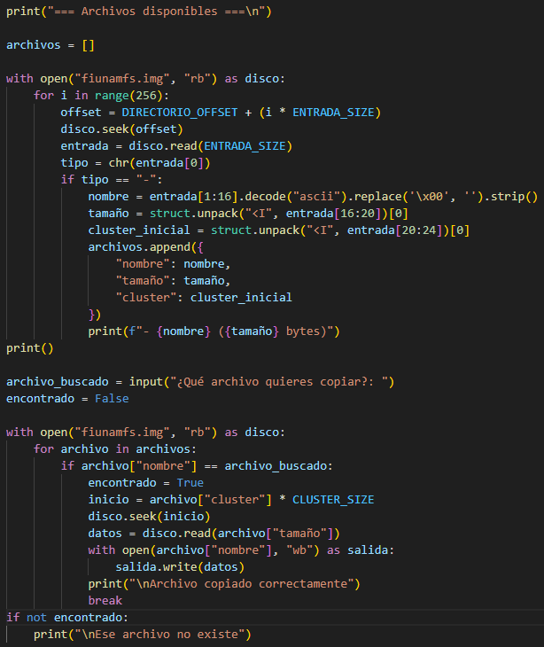,
  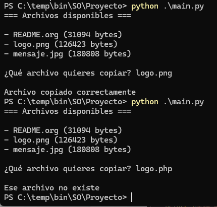, 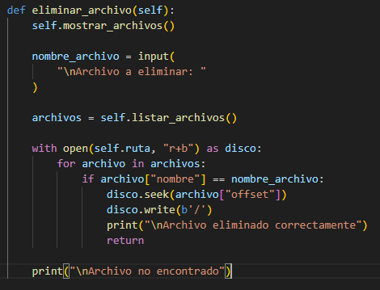, 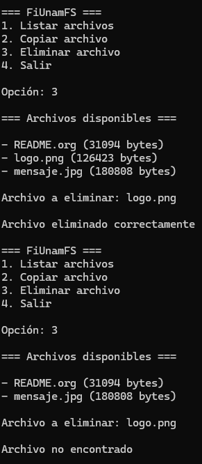, 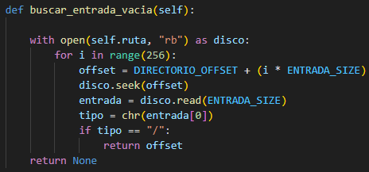,
  [[./SotomayorEdgar-TeranJorge/historialProyecto.txt][historialProyecto.txt]], [[./SotomayorEdgar-TeranJorge/prueba1.txt][prueba1.txt]]
- Archivos :: [[./SotomayorEdgar-TeranJorge/fiunamfs.img][fiunamfs.img]], [[./SotomayorEdgar-TeranJorge/fiunamfs.py][fiunamfs.py]], [[./SotomayorEdgar-TeranJorge/main.py][main.py]], [[./SotomayorEdgar-TeranJorge/threads.py][threads.py]]
- Concurrencia / sincronización ::
  - Un hilo para el menú, otro para registrar operaciones a bitácora (→ a
    consola)
    - Pero... en la ejecución del programa, no vi que se imprimiera nada
      con el formato esperado a la bitácora 🤔 (únicamente al copiar
      archivos hacia adentro del FiUnamFS)
- Interfaz :: Menú sobre línea de comando
- Comentarios ::
  - Hicieron un buen uso de Git, pero entregaron fuera del directorio del
    proyecto (yo lo tuve que mover) 🙁
  - Trabajan sobre un archivo =fiunamfs.img= que tiene que estar en el
    directorio actual...
    - ...Tendrían que permitir especificar otro directorio de origen, o
      listarlo en =.gitignore= para que la ejecución del programa no
      /ensucie/ a la representación en Git del directorio actual.
    - Misma cosa para la compilación a bytecode del código Python a
      =__pycache__=
  - Muy buena documentación, abordando incluso aspectos de /explicación/
    del código. ¡Muy bien! 🙂
  - Su código es 100% libre de comentarios 🙁

|------------------------+---------+------+--------|
| Rubro                  | Parcial | Peso | Puntos |
|------------------------+---------+------+--------|
| Proyecto               |         |  0.3 |   2.25 |
| Cumplimiento           |     7.5 |      |   0.75 |
| Claridad de desarrollo |     7.5 |      |   0.75 |
| Interfaz usuario       |     7.5 |      |   0.75 |
|------------------------+---------+------+--------|
| Desarrollo             |         |  0.3 |   2.25 |
| Directorio de proyecto |     7.5 |      |   0.75 |
| Código válido          |      10 |      |   1.00 |
| Comentarios            |       5 |      |   0.50 |
|------------------------+---------+------+--------|
| Legibilidad            |         |  0.2 |   2.00 |
| Estructura             |      10 |      |   1.00 |
| Nomenclatura           |      10 |      |   1.00 |
|------------------------+---------+------+--------|
| Entrega                |         |  0.2 |   1.84 |
| Documentación externa  |      10 |      |   0.67 |
| Entorno y dependencias |      10 |      |   0.67 |
| Historia en Git        |     7.5 |      |   0.50 |
|------------------------+---------+------+--------|
| TOTAL                  |         |      |   8.34 |
|------------------------+---------+------+--------|
#+TBLFM: @2$4=min(10, @3+@4+@5);f2::@3$4=$2 * @2$3/3;f2::@4$4=$2 * @2$3/3;f2::@5$4=$2 * @2$3/3;f2::@6$4=min(10, @7+@8+@9);f2::@7$4=$2 * @6$3/3;f2::@8$4=$2 * @6$3/3;f2::@9$4=$2 * @6$3/3;f2::@10$4=min(10, @11+@12);f2::@11$4=$2 * @10$3/2;f2::@12$4=$2 * @10$3/2;f2::@13$4=min(10.0, @14+@15+@16);f2::@14$4=$2 * @13$3/3;f2::@15$4=$2 * @13$3/3;f2::@16$4=$2 * @13$3/3;f2::@17$4=@2$4+@6$4+@10$4+@13$4;f2

** Torres, Lozano, Zavala, Magaña
- Documentación :: [[./Torres Lozano - Zavala Magaña/README.md][README.md]], [[./Torres Lozano - Zavala Magaña/imagenes/Opcion_1.png][Opcion_1.png]], [[./Torres Lozano - Zavala Magaña/imagenes/Opcion_2.png][Opcion_2.png]], 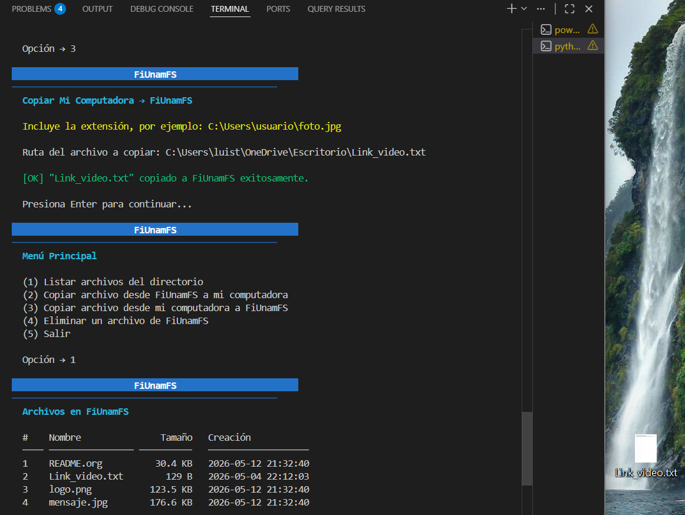,
  [[./Torres Lozano - Zavala Magaña/imagenes/Opcion_4.png][Opcion_4.png]], [[./Torres Lozano - Zavala Magaña/imagenes/Opcion_5.png][Opcion_5.png]]
- Archivos :: [[./Torres Lozano - Zavala Magaña/entrada_directorio.py][entrada_directorio.py]], [[./Torres Lozano - Zavala Magaña/principal.py][principal.py]], [[./Torres Lozano - Zavala Magaña/sistema_archivos.py][sistema_archivos.py]],
  [[./Torres Lozano - Zavala Magaña/utilidades.py][utilidades.py]]
- Concurrencia / sincronización ::
  - 5 hilos, cada uno de ellos especializado en una tarea
  - 6 semáforos controlan el flujo
- Interfaz :: Menú sobre línea de comando
- Comentarios ::
  - Buena separación funcional en los diferentes archivos especializados

|------------------------+---------+------+--------|
| Rubro                  | Parcial | Peso | Puntos |
|------------------------+---------+------+--------|
| Proyecto               |         |  0.3 |   2.50 |
| Cumplimiento           |      10 |      |   1.00 |
| Claridad de desarrollo |     7.5 |      |   0.75 |
| Interfaz usuario       |     7.5 |      |   0.75 |
|------------------------+---------+------+--------|
| Desarrollo             |         |  0.3 |   3.00 |
| Directorio de proyecto |      10 |      |   1.00 |
| Código válido          |      10 |      |   1.00 |
| Comentarios            |      10 |      |   1.00 |
|------------------------+---------+------+--------|
| Legibilidad            |         |  0.2 |   2.00 |
| Estructura             |      10 |      |   1.00 |
| Nomenclatura           |      10 |      |   1.00 |
|------------------------+---------+------+--------|
| Entrega                |         |  0.2 |   2.01 |
| Documentación externa  |      10 |      |   0.67 |
| Entorno y dependencias |      10 |      |   0.67 |
| Historia en Git        |      10 |      |   0.67 |
|------------------------+---------+------+--------|
| TOTAL                  |         |      |   9.51 |
|------------------------+---------+------+--------|
#+TBLFM: @2$4=min(10, @3+@4+@5);f2::@3$4=$2 * @2$3/3;f2::@4$4=$2 * @2$3/3;f2::@5$4=$2 * @2$3/3;f2::@6$4=min(10, @7+@8+@9);f2::@7$4=$2 * @6$3/3;f2::@8$4=$2 * @6$3/3;f2::@9$4=$2 * @6$3/3;f2::@10$4=min(10, @11+@12);f2::@11$4=$2 * @10$3/2;f2::@12$4=$2 * @10$3/2;f2::@13$4=min(10.0, @14+@15+@16);f2::@14$4=$2 * @13$3/3;f2::@15$4=$2 * @13$3/3;f2::@16$4=$2 * @13$3/3;f2::@17$4=@2$4+@6$4+@10$4+@13$4;f2

